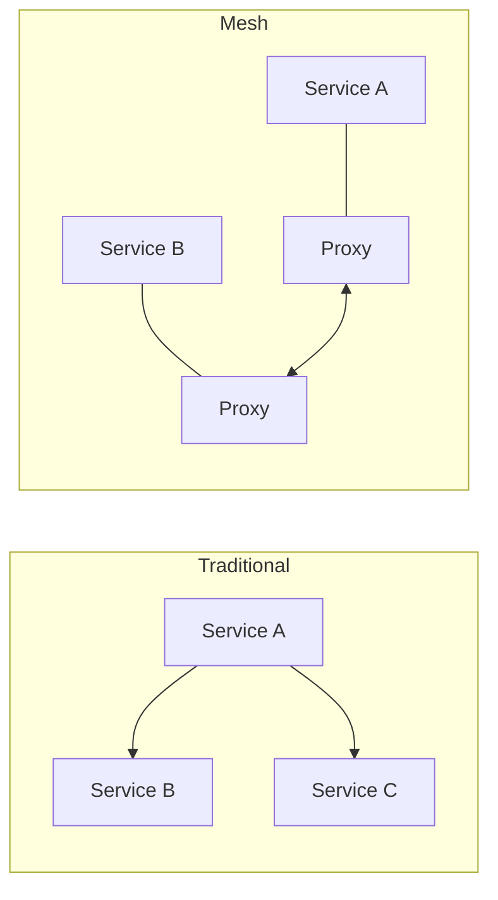
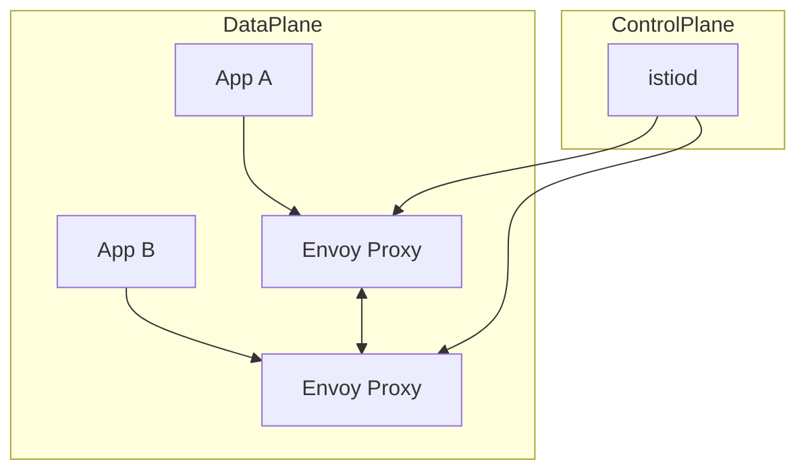
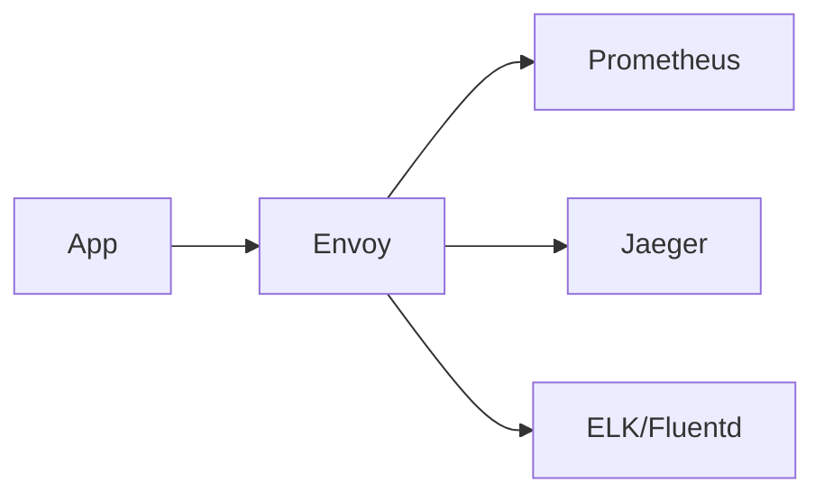
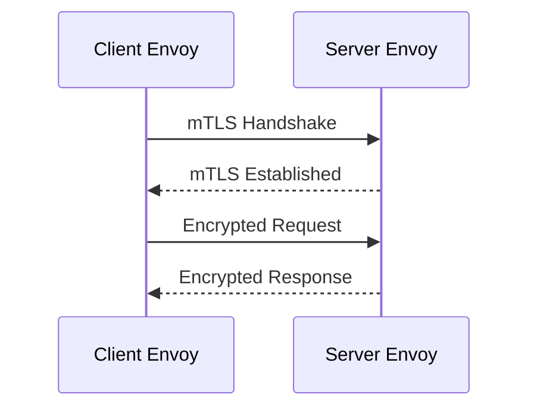

Absolutely! Here’s a **cleaner, more beginner-friendly theoretical guide to Istio Service Mesh**, focusing on the most important concepts. I’ll add brief explanations for each diagram and keep the flow logical and easy to follow. Advanced topics are left out for now—let’s keep it clear and practical.

---

# Istio Service Mesh: Essential Theoretical Guide

---

## 📋 Table of Contents
1. [Introduction to Istio](#1-introduction-to-istio)
2. [What is a Service Mesh?](#2-what-is-a-service-mesh)
3. [Istio Architecture (High-Level)](#3-istio-architecture-high-level)
4. [How Istio Handles Traffic](#4-how-istio-handles-traffic)
5. [Observability in Istio](#5-observability-in-istio)
6. [Istio Security Basics](#6-istio-security-basics)
7. [Installation & Operations (Overview)](#7-installation--operations-overview)
8. [Glossary of Key Terms](#8-glossary-of-key-terms)

---

## 1. 🚀 Introduction to Istio

**Istio** is an open-source service mesh that helps you manage, secure, and observe microservices running in your Kubernetes cluster (or VMs).

**Why use Istio?**
- **Traffic Control:** Route, split, and secure traffic between services.
- **Security:** Automatic encryption and identity for service-to-service calls.
- **Observability:** Built-in metrics, logs, and tracing.

---

## 2. 🏗️ What is a Service Mesh?

A **service mesh** is a dedicated layer for handling service-to-service communication. It adds features like traffic management, security, and monitoring—without changing your application code.

### Diagram: Traditional vs. Service Mesh

**Explanation:**  
- *Traditional*: Services talk directly.
- *Service Mesh*: Each service has a “sidecar” proxy (Envoy), and all communication goes through these proxies.



---

## 3. 🏛️ Istio Architecture (High-Level)

**Istio** has two main parts:
- **Data Plane:** Envoy proxies (sidecars) that handle all network traffic.
- **Control Plane:** istiod, which manages configuration and certificates.

### Diagram: Istio Architecture

**Explanation:**  
- Apps talk through Envoy proxies.
- istiod tells Envoy proxies how to behave.



---

## 4. 🚦 How Istio Handles Traffic

Istio lets you control how traffic flows between your services. This includes routing, retries, timeouts, and more.

### Example: Basic Traffic Routing

**Explanation:**  
- A user request enters the cluster through a gateway.
- The gateway sends it to the right service, following rules you define.


**Key Concepts:**
- **Gateway:** Entry point for external traffic.
- **VirtualService:** Rules for routing traffic to services.

---

## 5. 👁️ Observability in Istio

Istio gives you visibility into your service mesh with:
- **Metrics:** Numbers about requests, errors, and latency.
- **Tracing:** See how a request moves through services.
- **Logging:** Records of what happened.

### Diagram: Observability Flow

**Explanation:**  
- Envoy proxies collect data and send it to monitoring tools.



---

## 6. 🔐 Istio Security Basics

Istio helps secure your services by:
- **mTLS (mutual TLS):** Encrypts traffic and verifies identity between services.
- **Authorization:** Allows or denies requests based on rules.

### Diagram: mTLS Flow

**Explanation:**  
- Both sides (client and server) prove their identity, and traffic is encrypted.



---

## 7. 📦 Installation & Operations (Overview)

**How to install Istio?**
- **istioctl:** Easiest for beginners.
- **Helm:** For advanced, production setups.
- **Operator:** For automated, large-scale installs.

**Basic Command Example:**
```
istioctl install --set profile=demo
```

---

## 8. 📖 Glossary of Key Terms

| Term | Definition |
|------|------------|
| **Envoy** | Proxy that handles all network traffic (sidecar) |
| **istiod** | Istio’s control plane component |
| **Sidecar** | Extra container in your pod, runs Envoy |
| **Gateway** | Entry/exit point for mesh traffic |
| **mTLS** | Mutual encryption and authentication between services |
| **VirtualService** | Routing rules for traffic |
| **Prometheus/Jaeger** | Tools for metrics and tracing |

---

### **Summary**

- **Istio** makes microservices communication secure, observable, and manageable—without changing your code.
- The **sidecar pattern** is central: every service gets a proxy.
- **istiod** is the brain; **Envoy** is the muscle.
- You define traffic rules and security policies using simple YAML files.
- Observability is built-in: metrics, logs, and traces are automatic.

---

*For more details and hands-on examples, see the [Official Istio Docs](https://istio.io/latest/docs/).*

---

**Let me know if you want to dive deeper into any section, or need more diagrams or examples!**
