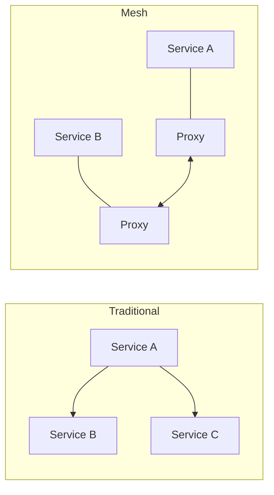
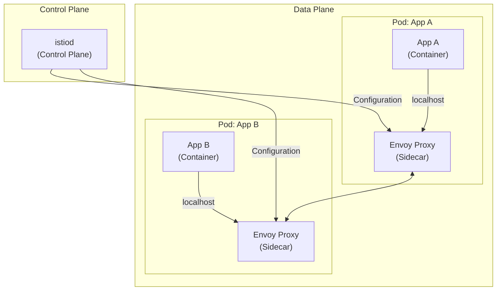
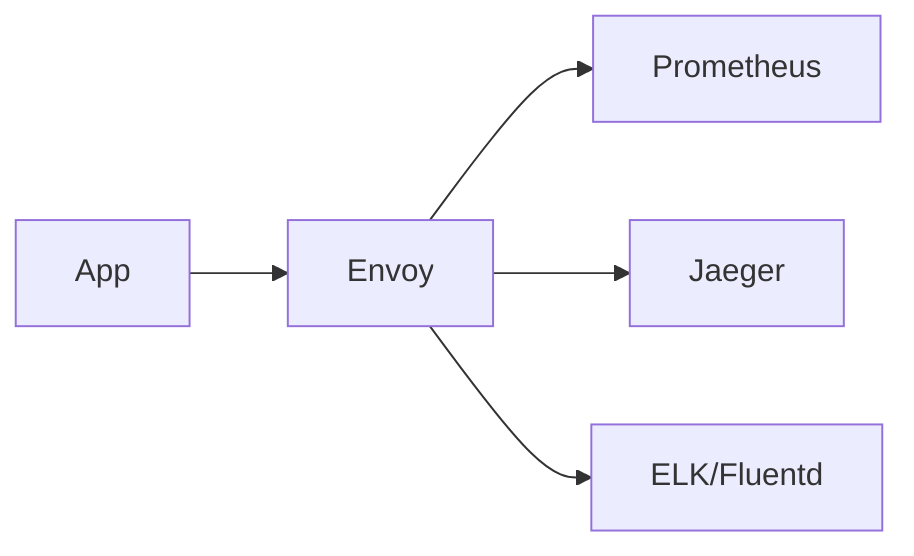
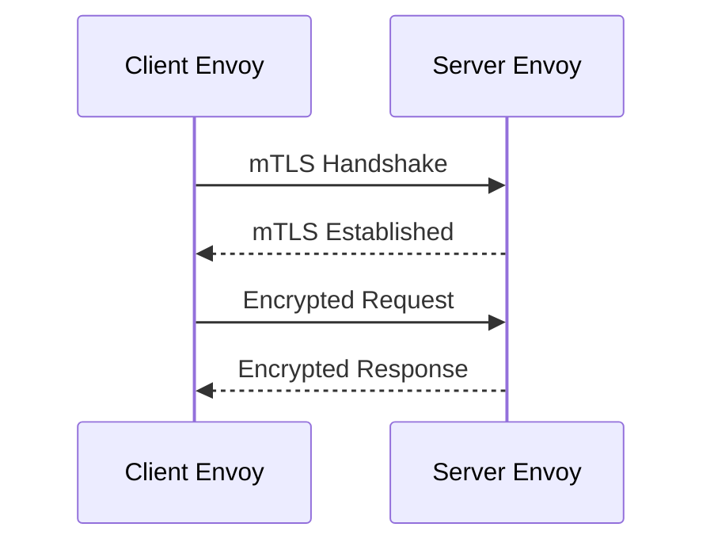
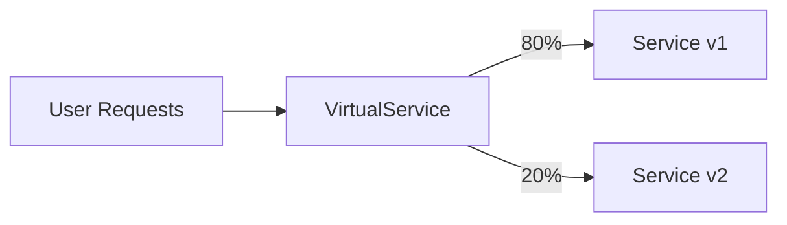
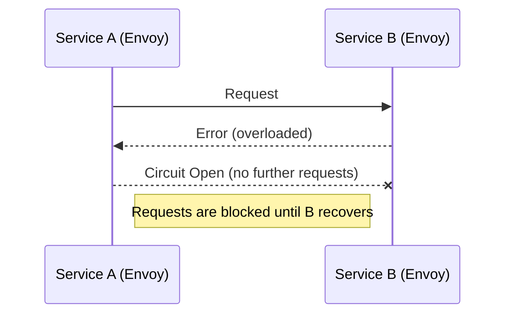
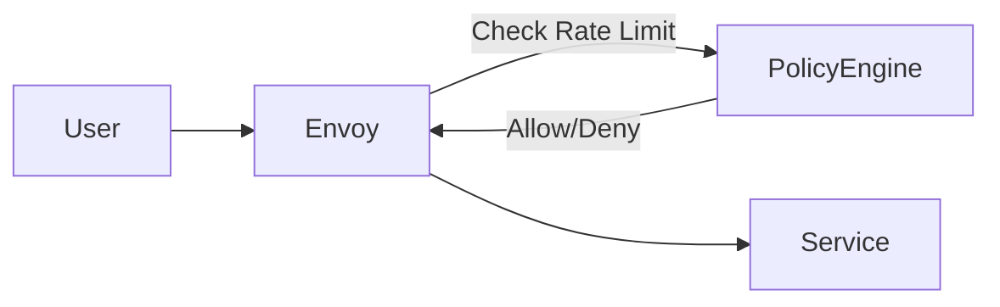
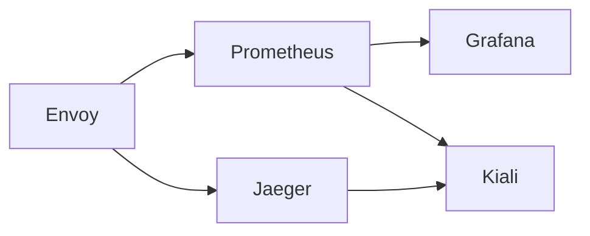

# Istio Service Mesh: Essential Theoretical Guide

---

## 📋 Table of Contents
1. [Introduction to Istio](#1-introduction-to-istio)
2. [What is a Service Mesh?](#2-what-is-a-service-mesh)
3. [Istio Architecture (High-Level)](#3-istio-architecture-high-level)
4. [How Istio Handles Traffic](#4-how-istio-handles-traffic)
5. [Observability in Istio](#5-observability-in-istio)
6. [Istio Security Basics](#6-istio-security-basics)
7. [Installation & Operations (Overview)](#7-installation--operations-overview)
8. [Glossary of Key Terms](#8-glossary-of-key-terms)
9. [Advanced Traffic Management](#9-advanced-traffic-management)
10. [Resilience Patterns](#10-resilience-patterns)
11. [Policy Enforcement](#11-policy-enforcement)
12. [Extending the Mesh (External Services & Egress)](#12-extending-the-mesh-external-services--egress)
13. [Multicluster and Federation (Overview)](#13-multicluster-and-federation-overview)
14. [Troubleshooting & Observability Tools](#14-troubleshooting--observability-tools)

---

## 1. 🚀 Introduction to Istio

**Istio** is an open-source service mesh that helps you manage, secure, and observe microservices running in your Kubernetes cluster (or VMs).

**Why use Istio?**
- **Traffic Control:** Route, split, and secure traffic between services.
- **Security:** Automatic encryption and identity for service-to-service calls.
- **Observability:** Built-in metrics, logs, and tracing.

---

## 2. 🏗️ What is a Service Mesh?

A **service mesh** is a dedicated layer for handling service-to-service communication. It adds features like traffic management, security, and monitoring—without changing your application code.

### Diagram: Traditional vs. Service Mesh

**Explanation:**  
- *Traditional*: Services talk directly.
- *Service Mesh*: Each service has a “sidecar” proxy (Envoy), and all communication goes through these proxies.



---

## 3. 🏛️ Istio Architecture (High-Level)

**Istio** has two main parts:
- **Data Plane:** Envoy proxies (sidecars) that handle all network traffic.
- **Control Plane:** istiod, which manages configuration and certificates.

### Diagram: Istio Architecture

**Explanation:**  
- Apps talk through Envoy proxies.
- istiod tells Envoy proxies how to behave.



---

## 4. 🚦 How Istio Handles Traffic

Istio lets you control how traffic flows between your services. This includes routing, retries, timeouts, and more.

### Example: Basic Traffic Routing

**Explanation:**  
- A user request enters the cluster through a gateway.
- The gateway sends it to the right service, following rules you define.


**Key Concepts:**
- **Gateway:** Entry point for external traffic.
- **VirtualService:** Rules for routing traffic to services.

---

## 5. 👁️ Observability in Istio

Istio gives you visibility into your service mesh with:
- **Metrics:** Numbers about requests, errors, and latency.
- **Tracing:** See how a request moves through services.
- **Logging:** Records of what happened.

### Diagram: Observability Flow

**Explanation:**  
- Envoy proxies collect data and send it to monitoring tools.



---

## 6. 🔐 Istio Security Basics

Istio helps secure your services by:
- **mTLS (mutual TLS):** Encrypts traffic and verifies identity between services.
- **Authorization:** Allows or denies requests based on rules.

### Diagram: mTLS Flow

**Explanation:**  
- Both sides (client and server) prove their identity, and traffic is encrypted.



---

## 7. 📦 Installation & Operations (Overview)

**How to install Istio?**
- **istioctl:** Easiest for beginners.
- **Helm:** For advanced, production setups.
- **Operator:** For automated, large-scale installs.

**Basic Command Example:**
```
istioctl install --set profile=demo
```

---

## 8. 📖 Glossary of Key Terms

| Term | Definition |
|------|------------|
| **Envoy** | Proxy that handles all network traffic (sidecar) |
| **istiod** | Istio’s control plane component |
| **Sidecar** | Extra container in your pod, runs Envoy |
| **Gateway** | Entry/exit point for mesh traffic |
| **mTLS** | Mutual encryption and authentication between services |
| **VirtualService** | Routing rules for traffic |
| **Prometheus/Jaeger** | Tools for metrics and tracing |

---

### **Summary**

- **Istio** makes microservices communication secure, observable, and manageable—without changing your code.
- The **sidecar pattern** is central: every service gets a proxy.
- **istiod** is the brain; **Envoy** is the muscle.
- You define traffic rules and security policies using simple YAML files.
- Observability is built-in: metrics, logs, and traces are automatic.

---

*For more details and hands-on examples, see the [Official Istio Docs](https://istio.io/latest/docs/).*

Absolutely! Here’s a **continuation of your Istio Service Mesh guide**, covering intermediate concepts in the same clean, practical, diagram-rich, and beginner-friendly style. This will help bridge the gap between basic and advanced usage—ideal for someone ready to go beyond the fundamentals.

---

## 9. 🚦 Advanced Traffic Management

Istio enables sophisticated control over how traffic flows between services.

### **Key Features:**
- **Weighted Routing:** Split traffic between versions (canary, blue/green).
- **Header-based Routing:** Route by user, device, or experiment group.
- **Fault Injection:** Simulate errors/latency for testing resilience.

### Diagram: Weighted Routing (Canary Release)

**Explanation:**  
Split 80% of traffic to `v1`, 20% to `v2` for gradual rollout.



### Example: Weighted Routing YAML

```yaml
apiVersion: networking.istio.io/v1beta1
kind: VirtualService
metadata:
  name: my-service
spec:
  hosts: ["my-service"]
  http:
    - route:
        - destination:
            host: my-service
            subset: v1
          weight: 80
        - destination:
            host: my-service
            subset: v2
          weight: 20
```

---

## 10. 🛡️ Resilience Patterns

Istio helps make microservices more resilient to failure.

### **Key Patterns:**
- **Retries:** Automatically retry failed requests.
- **Timeouts:** Limit how long a request waits.
- **Circuit Breaking:** Prevents overloading failing services.
- **Outlier Detection:** Ejects unhealthy pods from load balancing.

### Diagram: Circuit Breaking

**Explanation:**  
If Service B is overloaded, Envoy will stop sending requests until it recovers.



### Example: Circuit Breaker YAML

```yaml
apiVersion: networking.istio.io/v1beta1
kind: DestinationRule
metadata:
  name: reviews-cb
spec:
  host: reviews
  trafficPolicy:
    connectionPool:
      http:
        http1MaxPendingRequests: 1
        maxRequestsPerConnection: 1
    outlierDetection:
      consecutive5xxErrors: 1
      interval: 1s
      baseEjectionTime: 30s
      maxEjectionPercent: 100
```

---

## 11. 📝 Policy Enforcement

Istio lets you define and enforce policies for security and resource usage.

### **Key Policies:**
- **Rate Limiting:** Control how many requests a service can receive.
- **Access Control:** Fine-grained rules for who can call what.
- **Quota Management:** Limit resource consumption.

### Diagram: Rate Limiting

**Explanation:**  
Envoy checks rate limit policy before allowing requests through.



### Example: Authorization Policy YAML

```yaml
apiVersion: security.istio.io/v1beta1
kind: AuthorizationPolicy
metadata:
  name: allow-only-frontend
spec:
  selector:
    matchLabels:
      app: backend
  rules:
    - from:
        - source:
            principals: ["cluster.local/ns/default/sa/frontend"]
```

---

## 12. 🌐 Extending the Mesh (External Services & Egress)

By default, Istio controls only internal traffic. You can extend it to external services.

### **Key Concepts:**
- **ServiceEntry:** Register external services (APIs, databases) in the mesh.
- **Egress Gateway:** Control and secure outbound traffic.

### Diagram: Egress Gateway

**Explanation:**  
All external traffic goes through a managed egress gateway for security and monitoring.


### Example: ServiceEntry YAML

```yaml
apiVersion: networking.istio.io/v1beta1
kind: ServiceEntry
metadata:
  name: external-api
spec:
  hosts:
    - api.external.com
  location: MESH_EXTERNAL
  ports:
    - number: 443
      name: https
      protocol: HTTPS
  resolution: DNS
```

---

## 13. 🌍 Multicluster and Federation (Overview)

Istio supports connecting multiple Kubernetes clusters.

### **Why Multicluster?**
- High availability
- Disaster recovery
- Global service discovery

### Diagram: Multicluster Mesh

**Explanation:**  
Multiple clusters, each with its own Istio control plane, can be federated.

```mermaid
graph LR
    Cluster1[Cluster 1 (Istio)] <--> Cluster2[Cluster 2 (Istio)]
    Cluster1 <--> Cluster3[Cluster 3 (Istio)]
```

---

## 14. 🛠️ Troubleshooting & Observability Tools

### **Key Tools:**
- **istioctl:** Command-line tool for diagnostics.
- **Kiali:** Visualizes the mesh graph and traffic.
- **Prometheus/Grafana:** Metrics dashboards.
- **Jaeger/Zipkin:** Distributed tracing.

### Diagram: Observability Stack

**Explanation:**  
Metrics and traces flow from Envoy to monitoring backends, visualized by Kiali and Grafana.



### Common Troubleshooting Steps
- Check sidecar injection (`kubectl get pods -o jsonpath`)
- Validate config (`istioctl analyze`)
- Inspect Envoy config (`istioctl proxy-config`)
- Review mesh health in Kiali

---

### **Summary**

- **Intermediate Istio** covers advanced traffic control, resilience, policies, external connectivity, multicluster, and troubleshooting.
- **YAML CRDs** are central for defining mesh behavior.
- **Observability and security** are built-in and extendable.

---

*For advanced topics (custom telemetry, Wasm filters, deep multicluster, etc.), see the [Istio Docs](https://istio.io/latest/docs/).*  
**Let me know if you want hands-on examples, more YAML manifests, or a deep dive into any concept!**
