# Complete Theoretical Guide to Istio Service Mesh
---

## 📋 Table of Contents
1. [🚀 Introduction](#1-introduction)
2. [🏗️ Service Mesh Fundamentals](#2-service-mesh-fundamentals)
3. [🏛️ Istio Architecture Overview](#3-istio-architecture-overview)
4. [📡 Data Plane Deep Dive](#4-data-plane-deep-dive)
5. [🎛️ Control Plane Deep Dive](#5-control-plane-deep-dive)
6. [🚦 Traffic Management](#6-traffic-management)
7. [👁️ Observability & Telemetry](#7-observability--telemetry)
8. [🔐 Security Framework](#8-security-framework)
9. [⚙️ Policy & Extensibility](#9-policy--extensibility)
10. [🌐 Multicluster & Federation](#10-multicluster--federation)
11. [📦 Installation & Operations](#11-installation--operations)
12. [🔧 Troubleshooting & Best Practices](#12-troubleshooting--best-practices)
13. [📖 Glossary & References](#13-glossary--references)

---

## 1. 🚀 Introduction

### What is Istio?
Istio is an **open-source service mesh** that provides a uniform way to:
- **Connect** services securely
- **Control** traffic flow between services
- **Observe** service behavior and performance

### Core Value Propositions
| Capability | Without Istio | With Istio |
|------------|---------------|------------|
| **Traffic Management** | Load balancer configs | Declarative routing rules |
| **Security** | Application-level auth | Automatic mTLS + RBAC |
| **Observability** | Custom instrumentation | Built-in metrics/traces/logs |
| **Resilience** | Circuit breaker libraries | Proxy-level retries/timeouts |

### Key Benefits
- 🔄 **Zero-code changes** required for existing applications
- 🌐 **Language agnostic** - works with any protocol
- 📊 **Unified observability** across all services
- 🔒 **Security by default** with automatic mTLS

---

## 2. 🏗️ Service Mesh Fundamentals

### What is a Service Mesh?
A service mesh is a **dedicated infrastructure layer** that handles service-to-service communication in a microservices architecture.


### Service Mesh Patterns

#### Sidecar Pattern


### Comparison Matrix

| Feature | Library-Based | API Gateway | Service Mesh |
|---------|---------------|-------------|--------------|
| **Deployment** | In-process | Centralized | Sidecar |
| **Language Support** | Language-specific | Any | Any |
| **East-West Traffic** | ❌ | ❌ | ✅ |
| **Observability** | Manual | Limited | Automatic |
| **Security** | Manual | Perimeter | Zero-trust |
| **Operational Overhead** | Low | Medium | High |

---

## 3. 🏛️ Istio Architecture Overview

### High-Level Architecture


### Architecture Layers

| Layer | Component | Responsibility |
|-------|-----------|----------------|
| **Data Plane** | Envoy Proxies | Traffic handling, security enforcement |
| **Control Plane** | istiod | Configuration management, certificate authority |
| **Configuration** | Kubernetes CRDs | Declarative service mesh policies |

---

## 4. 📡 Data Plane Deep Dive

### Envoy Proxy Architecture


### Traffic Interception Flow


### Envoy Configuration Hierarchy


---

## 5. 🎛️ Control Plane Deep Dive

### istiod Components


### Configuration Flow


### Service Discovery Process


---

## 6. 🚦 Traffic Management

### Istio Traffic Management CRDs


### Traffic Routing Example
```mermaid
graph TB
    Client[Client Request]
    
    subgraph "Gateway Configuration"
        GW[Gateway<br/>*.example.com:80]
    end
    
    subgraph "VirtualService Rules"
        VS[VirtualService<br/>reviews.example.com]
        Rule1[/api/v1 → reviews-v1]
        Rule2[/api/v2 → reviews-v2]
        Rule3[Header: canary → reviews-v2]
    end
    
    subgraph "DestinationRule Policies"
        DR[DestinationRule<br/>reviews service]
        Subset1[Subset: v1<br/>version=v1]
        Subset2[Subset: v2<br/>version=v2]
    end
    
    Client --> GW
    GW --> VS
    VS --> Rule1
    VS --> Rule2
    VS --> Rule3
    Rule1 --> Subset1
    Rule2 --> Subset2
    Rule3 --> Subset2
    DR --> Subset1
    DR --> Subset2
```

### Advanced Traffic Patterns

#### Canary Deployment


#### Blue-Green Deployment


### Resilience Patterns


---

## 7. 👁️ Observability & Telemetry

### Three Pillars of Observability


### Telemetry Architecture


### Key Metrics Categories
| Category | Examples | Purpose |
|----------|----------|---------|
| **Request Metrics** | RPS, latency, error rate | Performance monitoring |
| **Connection Metrics** | Active connections, connection rate | Resource utilization |
| **Circuit Breaker** | Open/closed state, rejected requests | Resilience monitoring |
| **Upstream Metrics** | Healthy/unhealthy endpoints | Service health |

---

## 8. 🔐 Security Framework

### Istio Security Architecture


### mTLS Communication Flow


### Security Policies Hierarchy


### Authorization Policy Example

```mermaid
graph LR
    subgraph "Authorization Rules"
        Rule1[Allow GET /api/v1<br/>from: reviews service]
        Rule2[Allow POST /api/v2<br/>when: JWT present]
        Rule3[Deny all other requests]
    end
    
    Request[Incoming Request] --> Rule1
    Request --> Rule2
    Request --> Rule3
    
    Rule1 --> Allow1[✅ Allow]
    Rule2 --> Allow2[✅ Allow]
    Rule3 --> Deny[❌ Deny]
```


---

## 9. ⚙️ Policy & Extensibility

### Extension Points
```mermaid
graph TB
    subgraph "Envoy Extensions"
        HTTPFilters[HTTP Filters]
        NetworkFilters[Network Filters]
        AccessLoggers[Access Loggers]
    end
    
    subgraph "Extension Types"
        Wasm[WebAssembly<br/>Custom logic]
        Lua[Lua Scripts<br/>Lightweight processing]
        External[External Services<br/>AuthZ, Rate limiting]
    end
    
    HTTPFilters --> Wasm
    HTTPFilters --> Lua
    NetworkFilters --> External
    
    subgraph "Configuration"
        EnvoyFilter[EnvoyFilter CRD<br/>Low-level patches]
        WasmPlugin[WasmPlugin CRD<br/>High-level Wasm config]
    end
    
    EnvoyFilter --> HTTPFilters
    WasmPlugin --> Wasm
```

### WebAssembly Integration
```mermaid
sequenceDiagram
    participant Request
    participant Envoy
    participant WasmVM as Wasm VM
    participant WasmModule as Wasm Module
    
    Request->>Envoy: HTTP Request
    Envoy->>WasmVM: Initialize if needed
    WasmVM->>WasmModule: Load module
    Envoy->>WasmModule: Execute filter
    WasmModule-->>Envoy: Modified request/response
    Envoy-->>Request: Continue processing
```

---

## 10. 🌐 Multicluster & Federation

### Multicluster Deployment Models
```mermaid
graph TB
    subgraph "Primary-Remote Model"
        subgraph "Primary Cluster"
            P1[istiod Primary]
            P2[Workloads]
        end
        
        subgraph "Remote Cluster"
            R1[istiod Remote]
            R2[Workloads]
        end
        
        P1 -.->|Config sync| R1
    end
    
    subgraph "Multi-Primary Model"
        subgraph "Cluster 1"
            MP1[istiod-1]
            MW1[Workloads]
        end
        
        subgraph "Cluster 2"
            MP2[istiod-2]
            MW2[Workloads]
        end
        
        MP1 <-.->|Cross-cluster discovery| MP2
    end
```

### Cross-Cluster Communication
```mermaid
sequenceDiagram
    participant ServiceA as Service A<br/>(Cluster 1)
    participant EWG1 as East-West Gateway<br/>(Cluster 1)
    participant EWG2 as East-West Gateway<br/>(Cluster 2)
    participant ServiceB as Service B<br/>(Cluster 2)
    
    ServiceA->>EWG1: Request to service-b.ns.svc.cluster.local
    EWG1->>EWG2: mTLS cross-cluster
    EWG2->>ServiceB: Forward request
    ServiceB-->>EWG2: Response
    EWG2-->>EWG1: mTLS response
    EWG1-->>ServiceA: Response
```

---

## 11. 📦 Installation & Operations

### Installation Methods Comparison
| Method | Use Case | Pros | Cons |
|--------|----------|------|------|
| **istioctl** | Development, testing | Simple, fast | Limited customization |
| **Helm** | Production, GitOps | Templating, versioning | Complex configuration |
| **Operator** | Enterprise, automation | Lifecycle management | Additional complexity |

### Installation Profiles
```mermaid
graph TB
    subgraph "Installation Profiles"
        Demo[demo<br/>All features enabled<br/>Not for production]
        Default[default<br/>Production ready<br/>Recommended settings]
        Minimal[minimal<br/>Essential components only<br/>Lightweight]
        External[external<br/>External control plane<br/>Remote clusters]
    end
    
    Demo --> Components1[Istiod + Ingress + Egress<br/>+ Addons]
    Default --> Components2[Istiod + Ingress Gateway]
    Minimal --> Components3[Istiod only]
    External --> Components4[Remote configuration]
```

### Canary Upgrade Process
```mermaid
sequenceDiagram
    participant Operator
    participant OldRevision as Old Revision<br/>(1.18.0)
    participant NewRevision as New Revision<br/>(1.19.0)
    participant Workloads
    
    Operator->>NewRevision: Install new revision
    Operator->>Workloads: Label namespace (istio.io/rev=1-19-0)
    Operator->>Workloads: Restart pods
    Workloads->>NewRevision: Connect to new control plane
    Operator->>OldRevision: Verify no connections
    Operator->>OldRevision: Uninstall old revision
```

---

## 12. 🔧 Troubleshooting & Best Practices

### Common Issues & Solutions
```mermaid
graph TB
    subgraph "Traffic Issues"
        T1[503 Service Unavailable]
        T2[Connection Timeout]
        T3[SSL Handshake Failure]
    end
    
    subgraph "Configuration Issues"
        C1[Sidecar Not Injected]
        C2[VirtualService Not Working]
        C3[mTLS Conflicts]
    end
    
    subgraph "Diagnostic Tools"
        D1[istioctl proxy-status]
        D2[istioctl proxy-config]
        D3[istioctl analyze]
    end
    
    T1 --> D1
    T2 --> D2
    T3 --> D3
    C1 --> D1
    C2 --> D2
    C3 --> D3
```

### Troubleshooting Workflow
```mermaid
flowchart TD
    Start[Issue Reported]
    
    Check1{Sidecar Injected?}
    Check2{Control Plane Healthy?}
    Check3{Configuration Valid?}
    Check4{Network Connectivity?}
    
    Fix1[Enable injection<br/>Restart pods]
    Fix2[Check istiod logs<br/>Verify resources]
    Fix3[Run istioctl analyze<br/>Fix validation errors]
    Fix4[Check security policies<br/>Verify DNS resolution]
    
    Start --> Check1
    Check1 -->|No| Fix1
    Check1 -->|Yes| Check2
    Check2 -->|No| Fix2
    Check2 -->|Yes| Check3
    Check3 -->|No| Fix3
    Check3 -->|Yes| Check4
    Check4 -->|No| Fix4
```

### Performance Best Practices
| Area | Recommendation | Rationale |
|------|----------------|-----------|
| **Resource Limits** | Set CPU/memory limits | Prevent resource starvation |
| **Concurrency** | Tune `--concurrency` flag | Match CPU cores |
| **Configuration Scope** | Use Sidecar CRD | Reduce config size |
| **Telemetry** | Disable unused features | Reduce overhead |
| **Updates** | Use incremental updates | Minimize disruption |

### Security Best Practices
- ✅ Enable **STRICT mTLS** by default
- ✅ Use **least privilege** authorization policies
- ✅ Regularly **rotate certificates**
- ✅ Monitor **security metrics**
- ✅ Keep Istio **version updated**
- ❌ Don't expose **admin interfaces**
- ❌ Don't use **permissive mode** in production

---

## 13. 📖 Glossary & References

### Key Terms
| Term | Definition |
|------|------------|
| **Envoy** | High-performance proxy used as sidecar |
| **xDS** | Set of discovery APIs (LDS, RDS, CDS, EDS, SDS) |
| **SPIFFE** | Secure Production Identity Framework |
| **mTLS** | Mutual Transport Layer Security |
| **Sidecar** | Proxy container deployed alongside application |
| **Mesh** | Network of interconnected services |
| **Gateway** | Entry/exit point for mesh traffic |
| **Workload** | Application instance (pod, VM) |

### xDS APIs Explained
```mermaid
graph TB
    subgraph "xDS Discovery APIs"
        LDS[LDS - Listener Discovery<br/>Network listeners & ports]
        RDS[RDS - Route Discovery<br/>HTTP routing rules]
        CDS[CDS - Cluster Discovery<br/>Upstream service clusters]
        EDS[EDS - Endpoint Discovery<br/>Service instance endpoints]
        SDS[SDS - Secret Discovery<br/>TLS certificates & keys]
    end
    
    LDS --> RDS
    RDS --> CDS
    CDS --> EDS
    SDS --> LDS
    
    style LDS fill:#e3f2fd
    style RDS fill:#f3e5f5
    style CDS fill:#e8f5e8
    style EDS fill:#fff3e0
    style SDS fill:#ffebee
```

### Useful Commands
```bash
# Installation
istioctl install --set values.defaultRevision=default

# Configuration Analysis
istioctl analyze
istioctl proxy-status
istioctl proxy-config cluster <pod-name>

# Debugging
kubectl logs -n istio-system deployment/istiod
istioctl proxy-config bootstrap <pod-name>

# Security
istioctl authn tls-check <pod-name>
istioctl authz check <pod-name>
```

### References & Further Reading
- 📚 [Official Istio Documentation](https://istio.io/latest/docs/)
- 🎓 [Istio Fundamentals Course](https://academy.tetrate.io/)
- 📖 [Istio: Up and Running (O'Reilly)](https://www.oreilly.com/library/view/istio-up-and/9781492043775/)
- 🔧 [Envoy Proxy Documentation](https://www.envoyproxy.io/docs/)
- 🏛️ [CNCF Service Mesh Landscape](https://landscape.cncf.io/card-mode?category=service-mesh)

---

*This comprehensive guide covers all essential aspects of Istio service mesh technology. For the latest updates and detailed examples, always refer to the official Istio documentation.*

**Last Updated:** August 2025  
**Version:** Istio 1.20+
