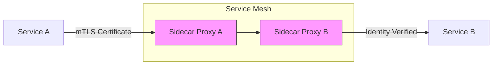

Alright! Let’s dive into **Service Identity in Service Mesh** with the same structured approach, including charts, configurations, and administrator-level insights.

---

# **Service Mesh Topic: Service Identity**

---

## **1. What is Service Identity?**

- **Definition:**  
  Service identity is a unique, cryptographically verifiable identifier assigned to each service in a service mesh. It enables secure communication between services and enforces policies based on their identities.

- **Purpose:**  
  - Authenticate services within the mesh.
  - Enable fine-grained access control (authorization).
  - Protect against impersonation and unauthorized access.

---

## **2. Key Features of Service Identity**

| **Feature**              | **Description**                                                                 |
|---------------------------|---------------------------------------------------------------------------------|
| **Unique Identity**       | Each service gets a unique identity (e.g., SPIFFE ID: `spiffe://cluster.local/ns/default/sa/my-service`). |
| **Automatic Certificate Management** | Service mesh handles issuing, renewing, and rotating certificates automatically. |
| **Mutual TLS (mTLS)**     | Identities are used for mTLS authentication between services.                  |
| **Authorization Policies**| Policies can be applied based on service identity.                            |
| **Zero Trust Security**   | Identity-based communication enforces "never trust, always verify."            |

---

## **3. How Does Service Identity Work in Service Mesh?**

### **A. Identity Assignment**
- Service identity is tied to:
  - **Namespace**: Scope of the service.
  - **Service Account**: Kubernetes service account associated with the pod.

### **B. Identity Verification**
- Service identity is verified using **X.509 certificates** issued by the service mesh control plane (e.g., Istio CA).

### **C. Communication Flow**
1. Service A connects to Service B.
2. Service A presents its identity (certificate).
3. Service B verifies Service A's identity using the mesh's CA.
4. Policies are enforced based on Service A's identity.

---

## **4. Example: Service Identity in Istio**

### **A. Identity Format**
- Istio uses **SPIFFE IDs** for service identities:
  ```
  spiffe://cluster.local/ns/<namespace>/sa/<service-account>
  ```

### **B. Configuring PeerAuthentication for mTLS**

```yaml
apiVersion: security.istio.io/v1beta1
kind: PeerAuthentication
metadata:
  name: enable-mtls
  namespace: default
spec:
  mtls:
    mode: STRICT
```
**Effect:**  
Enforces mTLS communication between services in the `default` namespace.

---

### **C. Authorization Policy Based on Identity**

```yaml
apiVersion: security.istio.io/v1beta1
kind: AuthorizationPolicy
metadata:
  name: allow-service-a
  namespace: default
spec:
  selector:
    matchLabels:
      app: service-b
  rules:
  - from:
    - source:
        principals: ["spiffe://cluster.local/ns/default/sa/service-a"]
```
**Effect:**  
Only allows requests from `service-a` to `service-b`.

---

## **5. Visual: Service Identity Flow**



---

## **6. Observability: Monitoring Service Identity**

### **A. Metrics**
- **Key Metrics:**  
  - `istio_peer_authentication_policy`: Tracks mTLS enforcement.  
  - `istio_requests_total{source_principal="spiffe://..."}:` Monitors traffic by identity.

### **B. Tracing**
- Distributed traces include service identity in metadata.
- Tools: Jaeger, Zipkin.

### **C. Logs**
- Envoy logs include identity details for incoming/outgoing requests.

---

## **7. Real-World Patterns and Scenarios**

### **A. Multi-Tenant Isolation**
- Assign unique identities to services in each tenant's namespace.
- Enforce policies to prevent cross-tenant communication.

### **B. External Service Access**
- Use ServiceEntry and DestinationRule to assign identities for external services.

### **C. Identity-Based Authorization**
```yaml
apiVersion: security.istio.io/v1beta1
kind: AuthorizationPolicy
metadata:
  name: tenant-isolation
  namespace: tenant-a
spec:
  selector:
    matchLabels:
      app: service-a
  rules:
  - from:
    - source:
        namespaces: ["tenant-a"]
        principals: ["spiffe://cluster.local/ns/tenant-a/sa/service-b"]
```
**Effect:**  
Allows only `service-b` in `tenant-a` to communicate with `service-a`.

---

## **8. Security Patterns**

### **A. Automatic Certificate Rotation**
- Service mesh automatically rotates certificates before expiration.

### **B. Zero Trust Policies**
- Enforce strict mTLS and identity-based rules for all communication.

### **C. Identity for External Services**
```yaml
apiVersion: networking.istio.io/v1beta1
kind: ServiceEntry
metadata:
  name: external-api
spec:
  hosts:
  - api.external-service.com
  ports:
  - number: 443
    name: https
    protocol: HTTPS
  resolution: DNS
  location: MESH_EXTERNAL
---
apiVersion: security.istio.io/v1beta1
kind: AuthorizationPolicy
metadata:
  name: external-access
  namespace: default
spec:
  rules:
  - from:
    - source:
        principals: ["spiffe://cluster.local/ns/default/sa/external-service"]
```
**Effect:**  
Allows communication only with `external-service` based on its identity.

---

## **9. Troubleshooting Service Identity**

| Symptom                        | Possible Cause                     | How to Investigate                  |
|--------------------------------|------------------------------------|-------------------------------------|
| mTLS handshake failure         | Certificate mismatch               | Check PeerAuthentication policies   |
| Unauthorized access errors      | Missing AuthorizationPolicy        | Verify identity-based rules         |
| Identity not recognized         | Incorrect SPIFFE ID format         | Check service account and namespace |
| Certificate expiration warnings| Rotation issues                    | Check mesh CA configuration         |

---

## **10. Best Practices**

- **Use namespace isolation** to scope identities.
- **Enable mTLS by default** for secure communication.
- **Audit service identities** regularly for unauthorized changes.
- **Monitor identity-based metrics** to detect anomalies.
- **Document identity rules** for troubleshooting and compliance.
- **Rotate certificates automatically** to avoid expiration issues.

---

## **11. Quick Checklist**

- [ ] Are service identities tied to namespaces and service accounts?
- [ ] Is mTLS enabled for all communication?
- [ ] Are authorization policies based on service identities?
- [ ] Are certificate rotations automated?
- [ ] Are identity-based metrics monitored?

---

## **Summary Table: Service Identity**

| Feature                | Description                        | Example Config/Pattern              |
|------------------------|------------------------------------|-------------------------------------|
| Unique Identity        | SPIFFE ID tied to namespace/account| `spiffe://cluster.local/ns/default/sa/my-service` |
| mTLS Authentication    | Secure communication between services| PeerAuthentication: `mtls.mode: STRICT` |
| Authorization Policies | Identity-based access control       | AuthorizationPolicy with `principals` |
| Certificate Rotation   | Automatic renewal of certificates  | Managed by service mesh CA          |
| Observability          | Metrics, logs, tracing             | Prometheus, Jaeger, Envoy logs      |

---

# **Would you like to:**
- Try a hands-on advanced scenario (e.g., configuring identities for multi-tenant isolation)?
- Take a quick quiz/checklist?
- Move to the next topic (e.g., traffic management, retries)?
- Or go even deeper into certificate management and SPIFFE ID customization?

**Let me know your choice!**
