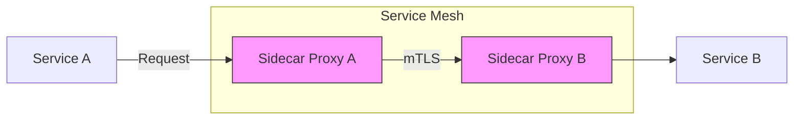

Alright! Let’s dive into **Service-to-Service Communication in Service Mesh** with the same structured approach, including charts, configurations, and administrator-level insights.

---

# **Service Mesh Topic: Service-to-Service Communication**

---

## **1. What is Service-to-Service Communication?**

- **Definition:**  
  Service-to-service communication refers to the interaction between microservices in a distributed system. In a service mesh, this communication is managed and secured by sidecar proxies.

- **Purpose:**  
  - Enable **secure communication** between services using mTLS.
  - Provide **dynamic routing** and traffic management.
  - Collect telemetry for observability.

---

## **2. Key Features of Service-to-Service Communication**

| **Feature**              | **Description**                                                                 |
|---------------------------|---------------------------------------------------------------------------------|
| **Dynamic Routing**       | Route traffic based on headers, weights, or paths.                             |
| **Security**              | Enforce mTLS and authorization policies for secure communication.              |
| **Traffic Policies**      | Configure retries, timeouts, and fault injection.                              |
| **Load Balancing**        | Distribute traffic across service instances.                                   |
| **Observability**         | Collect metrics, logs, and traces for communication flows.                     |

---

## **3. How Does Service-to-Service Communication Work?**

### **A. Communication Flow**
1. **Service A** sends a request to **Service B**.
2. The request passes through **Sidecar Proxy A**, which:
   - Enforces routing rules.
   - Encrypts traffic using mTLS.
3. The request reaches **Sidecar Proxy B**, which:
   - Decrypts traffic.
   - Enforces security policies (e.g., authorization).
4. The request is forwarded to **Service B**.

---

## **4. Example: Service-to-Service Communication in Istio**

### **A. Basic Routing Between Services**

```yaml
apiVersion: networking.istio.io/v1beta1
kind: VirtualService
metadata:
  name: service-a-to-service-b
spec:
  hosts:
  - service-b
  http:
  - route:
    - destination:
        host: service-b
        subset: v1
```
**Effect:**  
Routes traffic from `service-a` to `service-b` (subset `v1`).

---

### **B. Header-Based Routing**

```yaml
apiVersion: networking.istio.io/v1beta1
kind: VirtualService
metadata:
  name: header-based-routing
spec:
  hosts:
  - service-b
  http:
  - match:
    - headers:
        user-type:
          exact: "premium"
    route:
    - destination:
        host: service-b
        subset: premium
  - route:
    - destination:
        host: service-b
        subset: basic
```
**Effect:**  
Routes traffic based on the `user-type` header.

---

### **C. mTLS Between Services**

```yaml
apiVersion: security.istio.io/v1beta1
kind: PeerAuthentication
metadata:
  name: enable-mtls
  namespace: default
spec:
  mtls:
    mode: STRICT
```
**Effect:**  
Enforces mTLS for all communication in the `default` namespace.

---

### **D. Retry and Timeout Policies**

```yaml
apiVersion: networking.istio.io/v1beta1
kind: VirtualService
metadata:
  name: retry-timeout-policy
spec:
  hosts:
  - service-b
  http:
  - route:
    - destination:
        host: service-b
    retries:
      attempts: 3
      perTryTimeout: 2s
    timeout: 10s
```
**Effect:**  
Retries failed requests up to 3 times, with a 2-second timeout per attempt.

---

## **5. Visual: Service-to-Service Communication Flow**



---

## **6. Observability: Monitoring Service-to-Service Communication**

### **A. Metrics**
- **Key Metrics:**  
  - `istio_requests_total`: Total requests between services.  
  - `istio_request_duration_seconds`: Latency of requests.  
  - `istio_tcp_connections_open`: Active TCP connections.

### **B. Tracing**
- Distributed traces show the journey of requests across services.
- Tools: Jaeger, Zipkin.

### **C. Logs**
- Envoy logs provide detailed information about traffic flows.

---

## **7. Real-World Patterns and Scenarios**

### **A. Canary Deployment Between Services**
```yaml
apiVersion: networking.istio.io/v1beta1
kind: VirtualService
metadata:
  name: canary-deployment
spec:
  hosts:
  - service-b
  http:
  - route:
    - destination:
        host: service-b
        subset: v1
      weight: 90
    - destination:
        host: service-b
        subset: v2
      weight: 10
```
**Effect:**  
Routes 90% of traffic to `v1` and 10% to `v2` for testing.

---

### **B. Fault Injection for Resilience Testing**
```yaml
apiVersion: networking.istio.io/v1beta1
kind: VirtualService
metadata:
  name: fault-injection
spec:
  hosts:
  - service-b
  http:
  - route:
    - destination:
        host: service-b
      fault:
        delay:
          percentage: 50
          fixedDelay: 5s
        abort:
          percentage: 10
          httpStatus: 500
```
**Effect:**  
Simulates 50% delayed responses and 10% HTTP 500 errors for `service-b`.

---

### **C. Multi-Tenant Isolation**
```yaml
apiVersion: security.istio.io/v1beta1
kind: AuthorizationPolicy
metadata:
  name: tenant-isolation
  namespace: tenant-a
spec:
  selector:
    matchLabels:
      app: service-a
  rules:
  - from:
    - source:
        namespaces: ["tenant-a"]
```
**Effect:**  
Allows communication only between services in the same tenant namespace.

---

## **8. Security Patterns**

### **A. Mutual TLS (mTLS) Enforcement**
```yaml
apiVersion: security.istio.io/v1beta1
kind: PeerAuthentication
metadata:
  name: strict-mtls
  namespace: default
spec:
  mtls:
    mode: STRICT
```
**Effect:**  
Enforces mTLS for all service-to-service communication.

---

### **B. Identity-Based Authorization**
```yaml
apiVersion: security.istio.io/v1beta1
kind: AuthorizationPolicy
metadata:
  name: identity-based-auth
  namespace: default
spec:
  selector:
    matchLabels:
      app: service-b
  rules:
  - from:
    - source:
        principals: ["spiffe://cluster.local/ns/default/sa/service-a"]
```
**Effect:**  
Allows requests only from `service-a` based on its identity.

---

## **9. Troubleshooting Service-to-Service Communication**

| Symptom                        | Possible Cause                     | How to Investigate                  |
|--------------------------------|------------------------------------|-------------------------------------|
| High latency                   | Misconfigured retries/timeouts     | Check VirtualService settings       |
| Connection errors              | mTLS handshake failure             | Verify PeerAuthentication policies  |
| Unauthorized access errors      | Missing AuthorizationPolicy        | Check identity-based rules          |
| Traffic routing issues         | Incorrect VirtualService settings  | Verify routing rules and subsets    |

---

## **10. Best Practices**

- **Enable mTLS by default** for secure communication.
- **Use retries and timeouts** to handle transient failures.
- **Monitor metrics and logs** for traffic anomalies.
- **Simulate faults** to test service resilience.
- **Document routing policies** for audit and troubleshooting.
- **Isolate tenants** using namespaces and authorization policies.

---

## **11. Quick Checklist**

- [ ] Are routing rules configured correctly in VirtualService?
- [ ] Is mTLS enforced for all communication?
- [ ] Are retry and timeout policies applied?
- [ ] Are authorization policies based on service identity?
- [ ] Are fault injection policies tested in staging?

---

## **Summary Table: Service-to-Service Communication**

| Feature                | Description                        | Example Config/Pattern              |
|------------------------|------------------------------------|-------------------------------------|
| Dynamic Routing        | Route traffic based on headers, paths| VirtualService with routing rules   |
| Security               | mTLS, authorization policies       | PeerAuthentication + AuthPolicy     |
| Traffic Policies       | Retries, timeouts, fault injection | VirtualService with retry settings  |
| Load Balancing         | Distribute traffic across instances| Automatic via sidecar proxy         |
| Observability          | Metrics, logs, tracing             | Prometheus, Jaeger, Envoy logs      |

---

# **Would you like to:**
- Try a hands-on advanced scenario (e.g., fault injection, canary deployment)?
- Take a quick quiz/checklist?
- Move to the next topic (e.g., traffic management, retries)?
- Or go even deeper into multi-cluster communication?

**Let me know your choice!**
