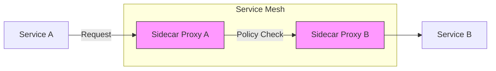

Alright! Let’s dive into **Policies in Service Mesh** with the same structured approach, including charts, configurations, and administrator-level insights.

---

# **Service Mesh Topic: Policies**

---

## **1. What are Policies in Service Mesh?**

- **Definition:**  
  Policies in a service mesh define rules and configurations that govern service behavior, communication, security, and observability.

- **Purpose:**  
  - Enforce **security** (e.g., mTLS, authentication, authorization).  
  - Define **traffic behavior** (e.g., retries, timeouts, fault injection).  
  - Implement **access control** for services.  
  - Enhance **observability** via logging and metrics.

---

## **2. Key Types of Policies**

| **Policy Type**           | **Description**                                                                 |
|----------------------------|---------------------------------------------------------------------------------|
| **Traffic Policies**       | Manage routing, retries, timeouts, load balancing, and fault injection.        |
| **Security Policies**      | Enforce authentication, authorization, and encryption (e.g., mTLS).           |
| **Access Control Policies**| Restrict communication between services based on identities or namespaces.     |
| **Observability Policies** | Define logging, tracing, and metrics collection rules.                         |

---

## **3. How Do Policies Work in Service Mesh?**

### **A. Policy Enforcement**
- Policies are applied at the **sidecar proxy level** (e.g., Envoy).
- The service mesh control plane (e.g., Istio) distributes policies to sidecar proxies.

### **B. Policy Scope**
- Policies can be applied at different levels:
  - **Namespace**: Policies apply to all services in a namespace.
  - **Workload**: Policies apply to specific services or pods.
  - **Global**: Policies apply across the entire mesh.

---

## **4. Example: Policies in Istio**

### **A. Security Policies**

#### **1. PeerAuthentication for mTLS**

```yaml
apiVersion: security.istio.io/v1beta1
kind: PeerAuthentication
metadata:
  name: enable-mtls
  namespace: default
spec:
  mtls:
    mode: STRICT
```
**Effect:**  
Enforces mTLS for all service-to-service communication in the `default` namespace.

---

#### **2. Authorization Policy**

```yaml
apiVersion: security.istio.io/v1beta1
kind: AuthorizationPolicy
metadata:
  name: allow-service-a
  namespace: default
spec:
  selector:
    matchLabels:
      app: service-b
  rules:
  - from:
    - source:
        principals: ["spiffe://cluster.local/ns/default/sa/service-a"]
```
**Effect:**  
Allows requests only from `service-a` to `service-b`.

---

### **B. Traffic Policies**

#### **1. Retry and Timeout Policy**

```yaml
apiVersion: networking.istio.io/v1beta1
kind: VirtualService
metadata:
  name: retry-timeout-policy
spec:
  hosts:
  - service-b
  http:
  - route:
    - destination:
        host: service-b
    retries:
      attempts: 3
      perTryTimeout: 2s
    timeout: 10s
```
**Effect:**  
Retries failed requests up to 3 times, with a 2-second timeout per attempt.

---

#### **2. Fault Injection Policy**

```yaml
apiVersion: networking.istio.io/v1beta1
kind: VirtualService
metadata:
  name: fault-injection
spec:
  hosts:
  - service-b
  http:
  - route:
    - destination:
        host: service-b
      fault:
        delay:
          percentage: 50
          fixedDelay: 5s
        abort:
          percentage: 10
          httpStatus: 500
```
**Effect:**  
Simulates 50% delayed responses and 10% HTTP 500 errors for `service-b`.

---

### **C. Observability Policies**

#### **1. Logging Policy**

```yaml
apiVersion: telemetry.istio.io/v1alpha1
kind: Telemetry
metadata:
  name: access-logs
  namespace: default
spec:
  accessLogging:
    - providers:
        - name: envoy
```
**Effect:**  
Enables access logs for services in the `default` namespace.

---

#### **2. Tracing Policy**

```yaml
apiVersion: telemetry.istio.io/v1alpha1
kind: Telemetry
metadata:
  name: tracing-policy
  namespace: default
spec:
  tracing:
    - providers:
        - name: zipkin
```
**Effect:**  
Enables distributed tracing using Zipkin for services in the `default` namespace.

---

## **5. Visual: Policy Enforcement Flow**



---

## **6. Observability: Monitoring Policies**

### **A. Metrics**
- **Key Metrics:**  
  - `istio_requests_total`: Total requests between services.  
  - `istio_request_duration_seconds`: Latency of requests.  
  - `istio_policy_denials_total`: Number of requests denied due to policy violations.

### **B. Tracing**
- Distributed traces show how policies impact communication flows.
- Tools: Jaeger, Zipkin.

### **C. Logs**
- Envoy logs provide detailed information about policy enforcement.

---

## **7. Real-World Patterns and Scenarios**

### **A. Tenant Isolation**
```yaml
apiVersion: security.istio.io/v1beta1
kind: AuthorizationPolicy
metadata:
  name: tenant-isolation
  namespace: tenant-a
spec:
  selector:
    matchLabels:
      app: service-a
  rules:
  - from:
    - source:
        namespaces: ["tenant-a"]
```
**Effect:**  
Restricts communication to services within the same tenant namespace.

---

### **B. Canary Deployment Policies**
```yaml
apiVersion: networking.istio.io/v1beta1
kind: VirtualService
metadata:
  name: canary-deployment
spec:
  hosts:
  - service-b
  http:
  - route:
    - destination:
        host: service-b
        subset: v1
      weight: 90
    - destination:
        host: service-b
        subset: v2
      weight: 10
```
**Effect:**  
Routes 90% of traffic to `v1` and 10% to `v2` for testing.

---

### **C. External Service Access**
```yaml
apiVersion: networking.istio.io/v1beta1
kind: ServiceEntry
metadata:
  name: external-api
spec:
  hosts:
  - api.external-service.com
  ports:
  - number: 443
    name: https
    protocol: HTTPS
  resolution: DNS
  location: MESH_EXTERNAL
```
**Effect:**  
Allows communication with external services like APIs.

---

## **8. Security Patterns**

### **A. Zero Trust Policies**
- Enforce strict mTLS and identity-based rules for all communication.

### **B. Certificate Rotation**
- Automate certificate renewal to avoid expiration issues.

---

## **9. Troubleshooting Policies**

| Symptom                        | Possible Cause                     | How to Investigate                  |
|--------------------------------|------------------------------------|-------------------------------------|
| Policy denial errors           | Incorrect AuthorizationPolicy      | Verify rules and identities         |
| mTLS handshake failure         | Certificate mismatch               | Check PeerAuthentication policies   |
| Traffic routing issues         | Misconfigured VirtualService       | Verify routing rules and subsets    |
| Observability gaps             | Missing Telemetry configuration    | Check logging and tracing policies  |

---

## **10. Best Practices**

- **Enable mTLS by default** for secure communication.
- **Use retries and timeouts** to handle transient failures.
- **Simulate faults** to test service resilience.
- **Monitor policy metrics** to detect anomalies.
- **Document policies** for audit and troubleshooting.
- **Isolate tenants** using namespaces and authorization policies.

---

## **11. Quick Checklist**

- [ ] Are security policies (mTLS, authorization) enforced?
- [ ] Are traffic policies (routing, retries, fault injection) applied?
- [ ] Are observability policies (logging, tracing) configured?
- [ ] Are policies scoped correctly (namespace, workload)?
- [ ] Are policy metrics monitored for violations?

---

## **Summary Table: Policies**

| Policy Type           | Description                        | Example Config/Pattern              |
|-----------------------|------------------------------------|-------------------------------------|
| Security Policies     | mTLS, authentication, authorization| PeerAuthentication + AuthPolicy     |
| Traffic Policies      | Routing, retries, fault injection  | VirtualService with retry settings  |
| Observability Policies| Logging, tracing, metrics          | Telemetry configuration             |
| Access Control Policies| Restrict communication            | AuthorizationPolicy with namespaces |

---

# **Would you like to:**
- Try a hands-on advanced scenario (e.g., tenant isolation, fault injection)?
- Take a quick quiz/checklist?
- Move to the next topic (e.g., observability, telemetry)?
- Or go deeper into multi-cluster policy management?

**Let me know your choice!**
