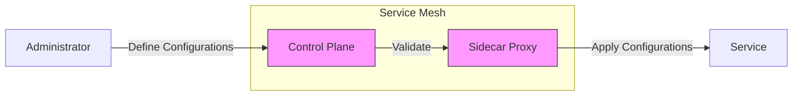

Alright! Let’s conclude with **Configuration Management in Service Mesh** using the same structured approach, including charts, configurations, and administrator-level insights.

---

# **Service Mesh Topic: Configuration Management**

---

## **1. What is Configuration Management in Service Mesh?**

- **Definition:**  
  Configuration management in a service mesh involves defining, distributing, and managing settings that control traffic, security, policies, and observability across the mesh.

- **Purpose:**  
  - Ensure **consistency** in configurations across services.  
  - Enable **dynamic updates** without downtime.  
  - Facilitate **scalability** and **automation**.  
  - Provide **version control** for configurations.

---

## **2. Key Features of Configuration Management**

| **Feature**              | **Description**                                                                 |
|---------------------------|---------------------------------------------------------------------------------|
| **Declarative Configuration** | Define desired states using YAML manifests.                                  |
| **Centralized Control**   | Manage configurations from a single control plane.                             |
| **Dynamic Updates**       | Apply changes without restarting services.                                     |
| **Validation**            | Prevent errors with built-in schema checks.                                    |
| **Versioning**            | Track changes and roll back configurations if needed.                          |

---

## **3. How Does Configuration Management Work in Service Mesh?**

### **A. Configuration Workflow**
1. **Define:** Create YAML manifests for traffic, security, and observability settings.
2. **Apply:** Submit configurations using tools like `kubectl` or service mesh CLI (e.g., `istioctl`).
3. **Distribute:** Control plane distributes configurations to sidecar proxies.
4. **Validate:** Control plane validates configurations before applying them.
5. **Monitor:** Observe the impact of configurations using metrics and logs.

---

## **4. Example: Configuration Management in Istio**

### **A. Traffic Management Configuration**

#### **VirtualService Example**
```yaml
apiVersion: networking.istio.io/v1beta1
kind: VirtualService
metadata:
  name: service-a-to-service-b
spec:
  hosts:
  - service-b
  http:
  - route:
    - destination:
        host: service-b
        subset: v1
```
**Effect:**  
Routes traffic from `service-a` to `service-b` (subset `v1`).

---

### **B. Security Configuration**

#### **PeerAuthentication Example**
```yaml
apiVersion: security.istio.io/v1beta1
kind: PeerAuthentication
metadata:
  name: enable-mtls
  namespace: default
spec:
  mtls:
    mode: STRICT
```
**Effect:**  
Enforces mTLS for all service-to-service communication in the `default` namespace.

---

### **C. Observability Configuration**

#### **Telemetry Example**
```yaml
apiVersion: telemetry.istio.io/v1alpha1
kind: Telemetry
metadata:
  name: tracing-policy
  namespace: default
spec:
  tracing:
    - providers:
        - name: zipkin
```
**Effect:**  
Enables distributed tracing using Zipkin for services in the `default` namespace.

---

### **D. Policy Configuration**

#### **AuthorizationPolicy Example**
```yaml
apiVersion: security.istio.io/v1beta1
kind: AuthorizationPolicy
metadata:
  name: allow-service-a
  namespace: default
spec:
  selector:
    matchLabels:
      app: service-b
  rules:
  - from:
    - source:
        principals: ["spiffe://cluster.local/ns/default/sa/service-a"]
```
**Effect:**  
Allows requests only from `service-a` to `service-b`.

---

## **5. Visual: Configuration Management Flow**



---

## **6. Tools for Configuration Management**

### **A. CLI Tools**
- **kubectl:** Apply, update, and delete configurations.  
  Example:  
  ```bash
  kubectl apply -f virtualservice.yaml
  ```
- **istioctl:** Validate and debug Istio configurations.  
  Example:  
  ```bash
  istioctl analyze -f virtualservice.yaml
  ```

### **B. GUI Tools**
- **Kiali:** Visualize service mesh configurations and traffic flows.  
- **Lens:** Kubernetes IDE for managing service mesh configurations.

---

## **7. Real-World Patterns and Scenarios**

### **A. Canary Deployment**
```yaml
apiVersion: networking.istio.io/v1beta1
kind: VirtualService
metadata:
  name: canary-deployment
spec:
  hosts:
  - service-b
  http:
  - route:
    - destination:
        host: service-b
        subset: v1
      weight: 90
    - destination:
        host: service-b
        subset: v2
      weight: 10
```
**Effect:**  
Routes 90% of traffic to `v1` and 10% to `v2` for testing.

---

### **B. Multi-Tenant Isolation**
```yaml
apiVersion: security.istio.io/v1beta1
kind: AuthorizationPolicy
metadata:
  name: tenant-isolation
  namespace: tenant-a
spec:
  selector:
    matchLabels:
      app: service-a
  rules:
  - from:
    - source:
        namespaces: ["tenant-a"]
```
**Effect:**  
Restricts communication to services within the same tenant namespace.

---

### **C. External Service Access**
```yaml
apiVersion: networking.istio.io/v1beta1
kind: ServiceEntry
metadata:
  name: external-api
spec:
  hosts:
  - api.external-service.com
  ports:
  - number: 443
    name: https
    protocol: HTTPS
  resolution: DNS
  location: MESH_EXTERNAL
```
**Effect:**  
Allows communication with external services like APIs.

---

## **8. Troubleshooting Configuration Issues**

| Symptom                        | Possible Cause                     | How to Investigate                  |
|--------------------------------|------------------------------------|-------------------------------------|
| Configuration validation errors| Incorrect YAML syntax              | Use `istioctl analyze`              |
| Policy denial errors           | Misconfigured AuthorizationPolicy  | Check rules and identities          |
| Traffic routing issues         | Incorrect VirtualService settings  | Verify routing rules and subsets    |
| Observability gaps             | Missing Telemetry configuration    | Check logging and tracing policies  |

---

## **9. Best Practices**

- **Use declarative YAML manifests** for consistency.
- **Validate configurations** using tools like `istioctl analyze`.
- **Automate configuration updates** using CI/CD pipelines.
- **Monitor configuration metrics** to detect anomalies.
- **Document configurations** for audit and troubleshooting.
- **Version control configurations** using GitOps practices.

---

## **10. Quick Checklist**

- [ ] Are configurations declarative and consistent?
- [ ] Are configurations validated before applying?
- [ ] Are dynamic updates applied without downtime?
- [ ] Are configurations version-controlled (e.g., GitOps)?
- [ ] Are metrics monitored for configuration impacts?

---

## **Summary Table: Configuration Management**

| Feature                | Description                        | Example Config/Pattern              |
|------------------------|------------------------------------|-------------------------------------|
| Declarative Configuration | Define desired states using YAML | VirtualService, PeerAuthentication  |
| Centralized Control    | Manage configurations via control plane| Istio control plane                |
| Dynamic Updates        | Apply changes without downtime     | kubectl, istioctl                   |
| Validation             | Prevent errors with schema checks  | istioctl analyze                    |
| Versioning             | Track changes and rollbacks        | GitOps practices                    |

---

# **Would you like to:**
- Try a hands-on advanced scenario (e.g., GitOps for service mesh configurations)?
- Take a quick quiz/checklist?
- Explore advanced topics like multi-cluster configuration management?
- Or wrap up the service mesh topics?

**Let me know your choice!**
