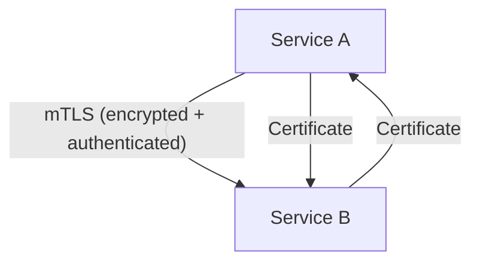
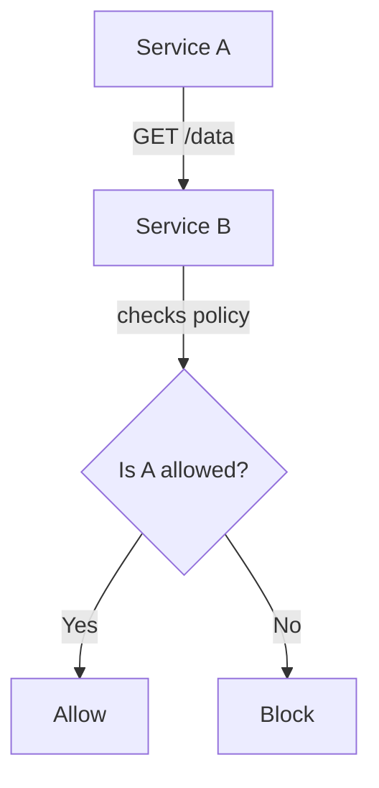
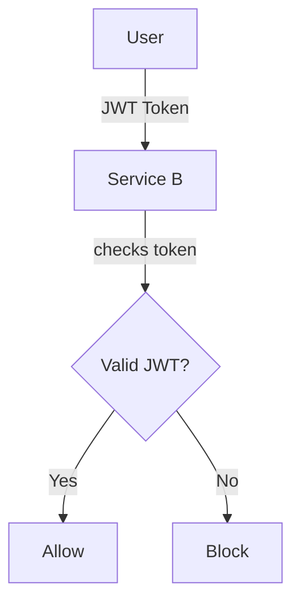
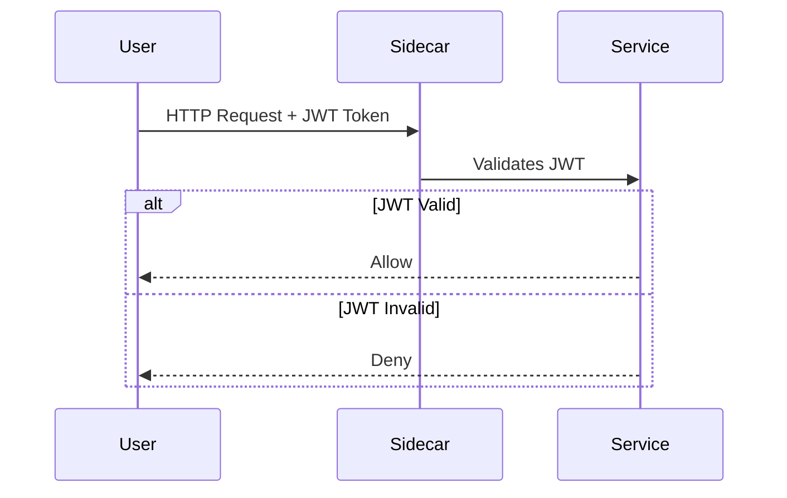
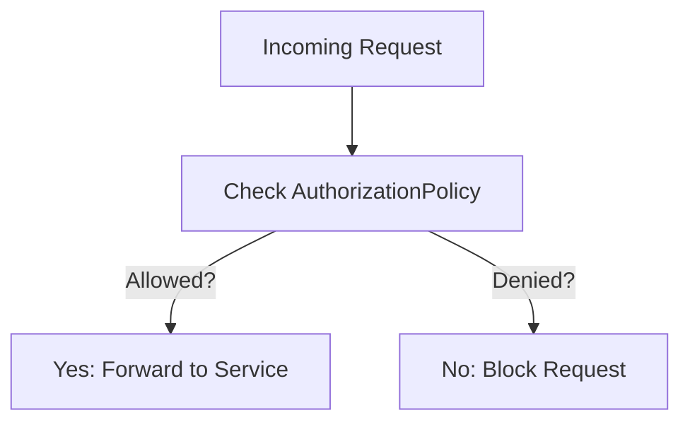
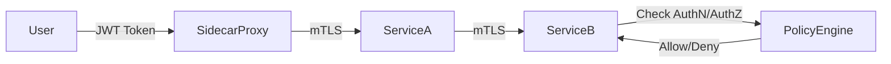

.
Absolutely! Let’s cover **Security in Service Mesh** (focusing on mTLS, Authorization, and Authentication) using the same clear, step-by-step approach with simple explanations, easy YAMLs, and visual diagrams.

---

## **Security in Service Mesh**

### **Why is Security Important in Service Mesh?**
- Microservices often talk to each other over the network—even inside the same cluster.
- Without security, anyone (even attackers) can potentially:
  - Eavesdrop on traffic (steal data)
  - Impersonate services (pretend to be another service)
  - Access sensitive endpoints

**Service Mesh security** ensures:
- Only the right services talk to each other.
- Data is encrypted in transit.
- Only authorized users/services can access sensitive resources.

---

## **1. Mutual TLS (mTLS)**

### **What is mTLS?**
- **TLS** (like HTTPS) encrypts communication between two endpoints.
- **Mutual TLS (mTLS)** means **both sides** (client and server) verify each other’s identity.
- In Service Mesh, mTLS is used to **encrypt all traffic between services** and **authenticate** both parties.

### **Why use mTLS?**
- Prevents eavesdropping (data is encrypted).
- Prevents impersonation (both sides verify identity).
- Enforces “zero trust” (trust no one by default).

---

### **How does mTLS work in Service Mesh?**

1. Each service gets a **certificate** (like an ID card).
2. When Service A talks to Service B:
   - **A** checks B’s certificate.
   - **B** checks A’s certificate.
   - If both are valid, they communicate over an **encrypted channel**.

---

### **Simple YAML Example: Enabling mTLS**

```yaml
apiVersion: security.istio.io/v1beta1
kind: PeerAuthentication
metadata:
  name: default
spec:
  mtls:
    mode: STRICT
```

**What does this do?**
- Enforces mTLS for all services in the namespace.
- All service-to-service traffic must be encrypted and authenticated.

---

### **Visual Diagram: mTLS in Action**



---

## **2. Authorization**

### **What is Authorization?**
- **Authorization** is about deciding **who can do what**.
- In Service Mesh, you can control **which services/users can access which resources**.

### **Why use Authorization?**
- Prevents unauthorized access.
- Allows fine-grained control (e.g., only Service A can call Service B’s `/admin` endpoint).

---

### **How does Authorization work in Service Mesh?**

- You write **Authorization Policies** (YAML) specifying:
  - **Who** is allowed (or denied).
  - **What** resources/endpoints they can access.
  - **Which** actions (GET, POST, etc.) are allowed.

---

### **Simple YAML Example: Authorization Policy**

```yaml
apiVersion: security.istio.io/v1beta1
kind: AuthorizationPolicy
metadata:
  name: allow-service-a-to-b
spec:
  selector:
    matchLabels:
      app: service-b
  rules:
  - from:
    - source:
        principals: ["cluster.local/ns/default/sa/service-a"]
    to:
    - operation:
        methods: ["GET"]
        paths: ["/data"]
```

**What does this do?**
- Only **Service A** (via its service account) can send **GET** requests to `/data` on **Service B**.

---

### **Visual Diagram: Authorization**



---

## **3. Authentication**

### **What is Authentication?**
- **Authentication** is about **proving who you are** (identity verification).
- In Service Mesh, it can be:
  - **Service-to-service** (mTLS does this automatically)
  - **End-user authentication** (e.g., verifying JWT tokens for users)

### **Why use Authentication?**
- Ensures only legitimate users and services can access your system.
- Prevents unauthorized or anonymous access.

---

### **How does Authentication work in Service Mesh?**

- For **end-users**, you can require a **JWT token** in the request.
- The mesh verifies the token before letting the request through.

---

### **Simple YAML Example: JWT Authentication Policy**

```yaml
apiVersion: security.istio.io/v1beta1
kind: RequestAuthentication
metadata:
  name: jwt-auth
spec:
  selector:
    matchLabels:
      app: service-b
  jwtRules:
  - issuer: "https://my-issuer.com"
    jwksUri: "https://my-issuer.com/.well-known/jwks.json"
```

**What does this do?**
- Requires a valid JWT token for requests to **Service B**.
- The token must be issued by `https://my-issuer.com`.

---

### **Visual Diagram: JWT Authentication**



---

## **Summary Table**

| Concept        | What It Does                   | Why It Matters                            | Example YAML Kind         |
|----------------|-------------------------------|-------------------------------------------|--------------------------|
| mTLS           | Encrypts & authenticates traffic | Prevents snooping & impersonation         | PeerAuthentication       |
| Authorization  | Controls **who can do what**   | Stops unauthorized access                 | AuthorizationPolicy      |
| Authentication | Verifies **who you are**       | Only real users/services allowed          | RequestAuthentication    |

---

## **Would you like to go deeper into any of these (mTLS, Authorization, Authentication) or move to the next security topic?**  
Let me know!

Absolutely! Let’s **deep dive** into each of these three security pillars—**Mutual TLS (mTLS), Authentication, and Authorization**—with practical scenarios, extra YAML examples, and more nuanced explanations. This will help you understand how these concepts work together in the real world.

---

# **1. Mutual TLS (mTLS) – Deep Dive**

## **How mTLS Works in Service Mesh**

- **Automatic Certificate Management:**  
  The service mesh (e.g., Istio) automatically generates and rotates certificates for each service.
- **Sidecar Proxies:**  
  Each service has a sidecar proxy (like Envoy) that handles encryption/decryption and authentication for you.
- **Policy Modes:**  
  - **PERMISSIVE:** Allows both encrypted (mTLS) and unencrypted traffic (useful for migration).
  - **STRICT:** Only allows mTLS traffic (fully secure).

---

### **Example: Enabling mTLS for a Specific Namespace**

```yaml
apiVersion: security.istio.io/v1beta1
kind: PeerAuthentication
metadata:
  name: default
  namespace: my-namespace
spec:
  mtls:
    mode: STRICT
```
- **Effect:** All services in `my-namespace` must use mTLS to talk to each other.

---

### **Migration Tip:**  
Start with `PERMISSIVE` mode to avoid breaking existing traffic, then switch to `STRICT` once all services support mTLS.

---

### **How to Check if mTLS is Working?**

- Use Istio’s dashboard or CLI to check the security status between services.
- Look for the **lock icon** or “mTLS” label in the traffic graph.

---

# **2. Authentication – Deep Dive**

## **Types of Authentication in Service Mesh**

**A. Service-to-Service Authentication**
- Handled by mTLS (as above).
- Each service is identified by its certificate.

**B. End-User Authentication (JWT)**
- Useful for APIs or web apps where users log in.

---

### **Example: Require JWT Authentication for a Service**

```yaml
apiVersion: security.istio.io/v1beta1
kind: RequestAuthentication
metadata:
  name: jwt-auth
  namespace: default
spec:
  selector:
    matchLabels:
      app: my-api
  jwtRules:
  - issuer: "https://accounts.google.com"
    jwksUri: "https://www.googleapis.com/oauth2/v3/certs"
```
- **Effect:**  
  Only requests with a valid Google-issued JWT token can access `my-api`.

---

### **Example: Combine JWT Authentication with Authorization**

```yaml
apiVersion: security.istio.io/v1beta1
kind: AuthorizationPolicy
metadata:
  name: allow-logged-in-users
  namespace: default
spec:
  selector:
    matchLabels:
      app: my-api
  rules:
  - from:
    - source:
        requestPrincipals: ["*"]  # Any authenticated user
```
- **Effect:**  
  Only requests with a valid JWT (any user) are allowed.

---

### **How JWT Authentication Works Visually**



---

# **3. Authorization – Deep Dive**

## **Types of Authorization Policies**

- **ALLOW/DENY**: Allow or deny traffic based on source, destination, methods, paths, etc.
- **Role-based Access Control (RBAC):**  
  Allow only users with certain roles or groups.

---

### **Example: Allow Only Admins to Access Sensitive Endpoint**

```yaml
apiVersion: security.istio.io/v1beta1
kind: AuthorizationPolicy
metadata:
  name: admin-only
  namespace: default
spec:
  selector:
    matchLabels:
      app: my-api
  rules:
  - from:
    - source:
        requestPrincipals: ["admin@mycompany.com"]
    to:
    - operation:
        paths: ["/admin"]
```
- **Effect:**  
  Only users with the JWT principal `admin@mycompany.com` can access `/admin` on `my-api`.

---

### **Example: Deny All Except Specific Service**

```yaml
apiVersion: security.istio.io/v1beta1
kind: AuthorizationPolicy
metadata:
  name: deny-all
spec:
  {}
---
apiVersion: security.istio.io/v1beta1
kind: AuthorizationPolicy
metadata:
  name: allow-service-a
spec:
  selector:
    matchLabels:
      app: service-b
  rules:
  - from:
    - source:
        principals: ["cluster.local/ns/default/sa/service-a"]
```
- **Effect:**  
  First policy denies all access to `service-b`, second policy allows only `service-a` to call it.

---

### **Visual Diagram: Authorization Decision Process**



---

# **How They Work Together**

- **mTLS:** Ensures all service-to-service traffic is encrypted and authenticated.
- **Authentication:** Verifies the identity of users (e.g., JWT).
- **Authorization:** Enforces policies about who/what can access which resources.

### **End-to-End Security Flow**



---

# **Summary Table (Deep Dive)**

| Feature        | What It Does               | How to Enable (YAML)         | Example Use Case                  |
|----------------|---------------------------|------------------------------|-----------------------------------|
| mTLS           | Encrypts traffic, authenticates services | PeerAuthentication           | Secure all service-to-service comms |
| Authentication | Verifies user/service identity (JWT) | RequestAuthentication        | Only logged-in users can call API |
| Authorization  | Controls access to resources | AuthorizationPolicy           | Only admins can access `/admin`   |

---

## **Any specific scenario you want to see? Or should we move to the next Service Mesh concept?**  
Let me know if you want more real-world examples (like canary deployments with mTLS, or combining JWT and RBAC), or if you’re ready to continue!
