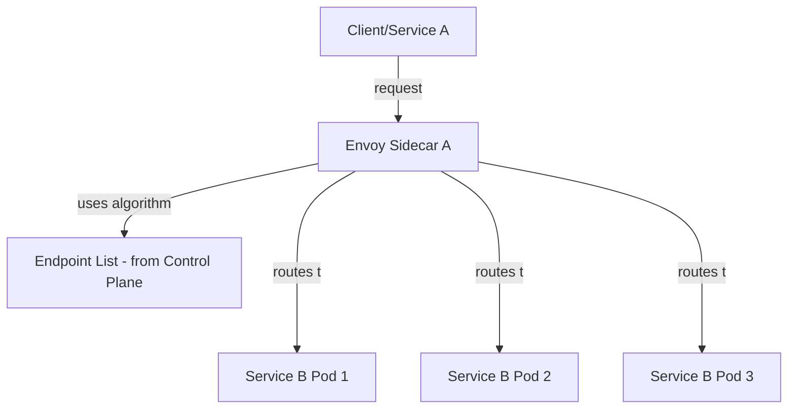
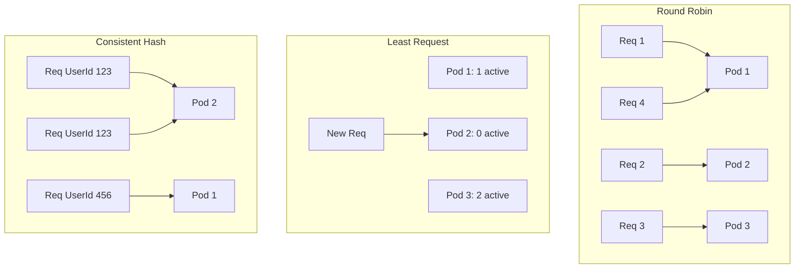

.
Absolutely! Let’s move to the next major service mesh topic: **Load Balancing**.  
We’ll cover it in the same clear, structured way as before: **what, why, how, patterns, examples, and best practices**.

---

# **Service Mesh Topic: Load Balancing**

---

## **1. What is Load Balancing?**

**Load balancing** is the process of distributing incoming network traffic across multiple backend servers (or pods) to ensure no single instance is overwhelmed, improve reliability, and optimize resource use.

---

## **2. Why is Load Balancing Important in Service Mesh?**

- **Scalability:** Handles more requests by spreading them across multiple pods.
- **Resilience:** If one instance fails, others can take over.
- **Performance:** Reduces latency by avoiding overloaded instances.
- **Zero-downtime Deployments:** Smooth traffic shifting during rolling updates.

---

## **3. How Does Load Balancing Work in a Service Mesh?**

### **A. Sidecar Proxies Handle Load Balancing**
- Each service instance has a **sidecar proxy** (like Envoy) that intercepts outgoing requests.
- The **sidecar** uses up-to-date info from the control plane to know all healthy endpoints for a target service.
- When a request is made, the sidecar picks an endpoint based on a **load balancing algorithm**.

### **B. Common Load Balancing Algorithms**

| Algorithm      | How It Works                                              | When to Use             |
|----------------|----------------------------------------------------------|-------------------------|
| Round Robin    | Each request goes to the next instance in order           | Default, general use    |
| Random         | Instance picked at random                                 | Simple, good for burst  |
| Least Request  | Sends to the instance with the fewest active requests     | Good for uneven loads   |
| Weighted       | Some instances get more traffic than others (by weight)   | Canary, blue/green      |
| Hash-based     | Uses a value (e.g., user ID) to always pick the same pod  | Sticky sessions         |

---

## **4. How Service Mesh Improves Load Balancing vs. Native Kubernetes**

| Feature              | Native Kubernetes      | Service Mesh Enhancement               |
|----------------------|-----------------------|----------------------------------------|
| LB Algorithm         | Simple round robin    | Multiple advanced algorithms           |
| Health Awareness     | Basic readiness probe | Mesh-aware, active health checks       |
| Fine-grained Control | Limited               | Per-route, per-service configuration   |
| Traffic Shifting     | Manual, complex       | Declarative YAML, traffic splitting    |

---

## **5. Example: Configuring Load Balancing in Istio**

### **A. Default (Round Robin)**
- **No extra config needed**—mesh uses round robin by default.

### **B. Customizing Load Balancer Policy**

```yaml
apiVersion: networking.istio.io/v1beta1
kind: DestinationRule
metadata:
  name: service-b
spec:
  host: service-b
  trafficPolicy:
    loadBalancer:
      simple: LEAST_CONN
```
**Effect:**  
Requests are sent to the instance with the fewest active connections.

### **C. Weighted Load Balancing (Traffic Splitting)**

```yaml
apiVersion: networking.istio.io/v1beta1
kind: VirtualService
metadata:
  name: service-b
spec:
  hosts:
    - service-b
  http:
    - route:
        - destination:
            host: service-b
            subset: v1
          weight: 70
        - destination:
            host: service-b
            subset: v2
          weight: 30
```
**Effect:**  
70% of traffic goes to v1, 30% to v2.

---

## **6. Visual: Load Balancing Flow in Service Mesh**



---

## **7. Observability: Monitoring Load Balancing**

- **Metrics:**  
  - Request counts per pod
  - Latency per backend
  - Active connections
- **Logs:**  
  - Sidecar logs show which pod handled each request
- **Tracing:**  
  - Distributed traces reveal which backend served the request

---

## **8. Real-World Patterns & Best Practices**

- **Use least request for unpredictable workloads** (e.g., some requests take longer than others).
- **Use weighted routing for safe rollouts** (canary, blue/green).
- **Monitor backend health and adjust policies as needed**.
- **Avoid sticky sessions unless absolutely necessary** (stateless services scale better).

---

## **9. Common Troubleshooting Scenarios**

- **Uneven traffic distribution:**  
  - Check for misconfigured weights or unhealthy pods.
- **High latency:**  
  - Investigate overloaded pods or network issues.
- **All traffic to one pod:**  
  - Ensure all pods are healthy and registered.

---

## **10. Summary Table**

| Aspect              | How Mesh Handles It                 | Example Config         |
|---------------------|-------------------------------------|-----------------------|
| LB Algorithm        | Round robin, least request, etc.    | DestinationRule       |
| Traffic Splitting   | Weighted, per version               | VirtualService        |
| Health Awareness    | Mesh-aware health checks            | Automatic             |
| Observability       | Metrics, logs, tracing              | Prometheus, Jaeger    |

---

# **Would you like to:**
- Go deeper into advanced load balancing algorithms or scenarios?
- Try a quick quiz/checklist?
- Move to the next topic (e.g., traffic management, resilience, fault injection)?
- Or see a hands-on example?

**Let me know your preference!**

Great! Let’s **deep dive into Load Balancing (LB) in Service Mesh**.  
We’ll cover advanced algorithms, real-world scenarios, configuration tips, observability, troubleshooting, and best practices—just like before.

---

# **Deep Dive: Load Balancing in Service Mesh**

---

## **1. Advanced Load Balancing Algorithms**

### **A. Round Robin**
- **How it works:** Each request is sent to the next available instance in order.
- **Use case:** Default, works well for similar workloads.

### **B. Least Request (Least Connections)**
- **How it works:** Sends each new request to the instance with the fewest active requests.
- **Use case:** Great for workloads where some requests take longer (avoids overloading a slow pod).

### **C. Random**
- **How it works:** Randomly picks an instance from the available pool.
- **Use case:** Simple, can help avoid “herd” effects.

### **D. Weighted (Proportional)**
- **How it works:** Assigns a weight to each instance or subset; more weight = more traffic.
- **Use case:** Canary, blue/green, or gradual rollouts.

### **E. Hash-based (Consistent Hashing)**
- **How it works:** Uses a hash of some request property (like user ID) to always pick the same backend.
- **Use case:** Sticky sessions (e.g., shopping carts, user state).

---

## **2. Advanced Configuration Examples (Istio)**

### **A. Least Request Example**

```yaml
apiVersion: networking.istio.io/v1beta1
kind: DestinationRule
metadata:
  name: service-b
spec:
  host: service-b
  trafficPolicy:
    loadBalancer:
      simple: LEAST_REQUEST
```

### **B. Consistent Hashing Example**

```yaml
apiVersion: networking.istio.io/v1beta1
kind: DestinationRule
metadata:
  name: service-b
spec:
  host: service-b
  trafficPolicy:
    loadBalancer:
      consistentHash:
        httpHeaderName: "X-User-Id"
```
**Effect:**  
Requests with the same `X-User-Id` header go to the same backend pod.

### **C. Weighted Subset Example (Canary Release)**

```yaml
apiVersion: networking.istio.io/v1beta1
kind: VirtualService
metadata:
  name: service-b
spec:
  hosts:
    - service-b
  http:
    - route:
        - destination:
            host: service-b
            subset: v1
          weight: 90
        - destination:
            host: service-b
            subset: v2
          weight: 10
```
**Effect:**  
90% of traffic to v1, 10% to canary v2.

---

## **3. Visual: Comparing Algorithms**



---

## **4. Real-World Scenarios**

### **A. Canary Deployment**
- Deploy new version as a subset.
- Use weighted LB to gradually shift traffic.
- Observe metrics, then increase weight if all is well.

### **B. Hotspot Avoidance**
- Some requests are “heavier” (take longer).
- Use least request to prevent overloading a single pod.

### **C. Sticky Sessions**
- User needs to always hit the same backend (e.g., in-memory session).
- Use consistent hashing on a user or session ID.

---

## **5. Observability: How to Monitor LB Effectiveness**

- **Metrics:**
  - Per-pod request counts (should be balanced).
  - Request latency and error rates.
  - Active connection counts.
- **Distributed Tracing:**
  - See which pod served each request.
- **Dashboards:**
  - Use Prometheus + Grafana or Kiali for Istio.

---

## **6. Troubleshooting Load Balancing**

| Symptom                        | Possible Cause                           | How to Investigate                  |
|---------------------------------|------------------------------------------|-------------------------------------|
| All traffic to one pod          | Unhealthy pods, misconfigured weights    | Check pod health, weights, logs     |
| Uneven traffic distribution     | Sticky sessions, hash collisions         | Review config, check hash keys      |
| High pod latency                | Overloaded pod, slow backend             | Check metrics, autoscale if needed  |
| Traffic not shifting as expected| Bad VirtualService/DestinationRule YAML  | Validate YAML, check mesh logs      |

---

## **7. Best Practices**

- **Keep services stateless** when possible (easier to load balance).
- **Monitor traffic distribution**—set up alerts for imbalance.
- **Test new LB policies in staging before production.**
- **Combine health checks and LB** for best resilience.
- **Document custom weights or hash keys** for team clarity.

---

## **8. Quick Checklist**

- Do you know which LB algorithm your mesh uses by default?
- Can you configure and validate a custom LB policy?
- Can you monitor and troubleshoot traffic distribution?
- Do you know when to use sticky sessions vs. stateless?

---

## **Summary Table: Advanced LB Features**

| Feature             | Description                             | Example Config/Scenario      |
|---------------------|-----------------------------------------|-----------------------------|
| Least Request       | Avoids hot spots                        | DestinationRule, LEAST_REQ  |
| Weighted Routing    | Canary/gradual rollout                  | VirtualService weights      |
| Consistent Hashing  | Sticky sessions                         | Hash on header/cookie       |
| Observability       | Metrics, tracing, dashboards            | Prometheus, Grafana, Kiali  |

---

# **Would you like to:**
- Try a hands-on LB scenario (step-by-step)?
- Take a quick quiz/checklist?
- Move to the next topic (e.g., traffic management, resilience)?
- Or go even deeper (e.g., Envoy LB internals, custom plugins)?

**Let me know your choice!**
