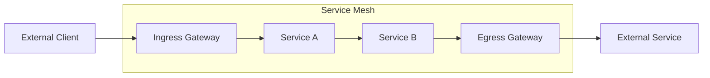
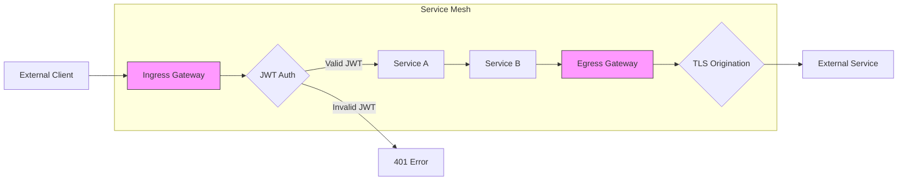

Absolutely! Let's cover **Ingress and Egress in Service Mesh** with the same structured, practical approach.

---

# **Service Mesh Topic: Ingress and Egress**

---

## **1. What are Ingress and Egress in Service Mesh?**

- **Ingress:**  
  The entry point for external traffic coming into your service mesh (outside → inside).

- **Egress:**  
  The exit point for traffic leaving your service mesh to external services (inside → outside).

---

## **2. Why are Ingress and Egress Important in Service Mesh?**

- **Security:**  
  Control and secure the entry/exit points of your mesh.
- **Observability:**  
  Monitor all traffic entering and leaving your mesh.
- **Traffic Management:**  
  Apply routing, load balancing, and policies at the edge.
- **Protocol Translation:**  
  Convert external protocols to internal mesh protocols.

---

## **3. How Do Ingress and Egress Work in a Service Mesh?**

- **Ingress Gateway:**  
  A specialized proxy that receives external traffic and routes it to services inside the mesh.
- **Egress Gateway:**  
  A specialized proxy that handles traffic from mesh services to external destinations.
- Both are typically deployed as separate pods/services with their own configuration.

---

## **4. Example: Configuring Ingress in Istio**

### **A. Basic Ingress Gateway**

```yaml
apiVersion: networking.istio.io/v1beta1
kind: Gateway
metadata:
  name: my-gateway
spec:
  selector:
    istio: ingressgateway # Use Istio's default gateway
  servers:
  - port:
      number: 80
      name: http
      protocol: HTTP
    hosts:
    - "example.com"
```

### **B. Routing Traffic from Gateway to Service**

```yaml
apiVersion: networking.istio.io/v1beta1
kind: VirtualService
metadata:
  name: frontend-vs
spec:
  hosts:
  - "example.com"
  gateways:
  - my-gateway
  http:
  - match:
    - uri:
        prefix: /api
    route:
    - destination:
        host: api-service
        port:
          number: 8080
  - route:
    - destination:
        host: frontend-service
        port:
          number: 80
```
**Effect:**  
- Traffic to `example.com/api/*` goes to `api-service`.
- All other traffic to `example.com` goes to `frontend-service`.

---

## **5. Example: Configuring Egress in Istio**

### **A. Direct Egress (ServiceEntry)**

```yaml
apiVersion: networking.istio.io/v1beta1
kind: ServiceEntry
metadata:
  name: external-api
spec:
  hosts:
  - api.external-service.com
  ports:
  - number: 443
    name: https
    protocol: HTTPS
  resolution: DNS
  location: MESH_EXTERNAL
```
**Effect:**  
Services in the mesh can directly access `api.external-service.com`.

### **B. Egress Gateway**

```yaml
# 1. Define ServiceEntry for external service
apiVersion: networking.istio.io/v1beta1
kind: ServiceEntry
metadata:
  name: external-api
spec:
  hosts:
  - api.external-service.com
  ports:
  - number: 443
    name: https
    protocol: HTTPS
  resolution: DNS
  location: MESH_EXTERNAL
---
# 2. Define Gateway for egress
apiVersion: networking.istio.io/v1beta1
kind: Gateway
metadata:
  name: egress-gateway
spec:
  selector:
    istio: egressgateway
  servers:
  - port:
      number: 443
      name: https
      protocol: HTTPS
    hosts:
    - api.external-service.com
---
# 3. Route traffic through egress gateway
apiVersion: networking.istio.io/v1beta1
kind: VirtualService
metadata:
  name: direct-external-through-egress-gateway
spec:
  hosts:
  - api.external-service.com
  gateways:
  - mesh
  - egress-gateway
  http:
  - match:
    - gateways:
      - mesh
      port: 443
    route:
    - destination:
        host: istio-egressgateway.istio-system.svc.cluster.local
        port:
          number: 443
  - match:
    - gateways:
      - egress-gateway
      port: 443
    route:
    - destination:
        host: api.external-service.com
        port:
          number: 443
```
**Effect:**  
All traffic to `api.external-service.com` is routed through the egress gateway.

---

## **6. Visual: Ingress and Egress Flow**



---

## **7. Observability: Monitoring Ingress and Egress**

- **Metrics:**
  - `istio_requests_total{reporter="source", destination_service="istio-ingressgateway"}`
  - `istio_requests_total{reporter="source", destination_service="istio-egressgateway"}`
- **Tracing:**
  - Distributed traces show the full path from ingress to services to egress.
- **Dashboards:**
  - Kiali/Grafana visualize traffic flow through gateways.

---

## **8. Real-World Patterns and Scenarios**

### **A. Multi-tenant Ingress**
- Use multiple gateways or route by hostname/path.

### **B. TLS Termination at Ingress**
- Terminate HTTPS at the gateway, use HTTP internally.

### **C. Controlled External Access**
- Restrict which services can access external endpoints.

### **D. Protocol Translation**
- Convert external REST to internal gRPC at the gateway.

---

## **9. Troubleshooting Ingress and Egress**

| Symptom                        | Possible Cause                    | How to Investigate                  |
|---------------------------------|-----------------------------------|-------------------------------------|
| External traffic not reaching service | Gateway or VirtualService misconfigured | Check Gateway, VirtualService, hosts |
| Cannot access external service | ServiceEntry missing or incorrect | Verify ServiceEntry, DNS resolution |
| TLS errors at gateway          | Certificate issues                | Check cert/key in Gateway config    |
| Traffic bypassing egress gateway | Direct access not restricted    | Apply mesh-wide outbound traffic policy |

---

## **10. Best Practices**

- **Secure ingress** with TLS and authentication.
- **Monitor traffic** at ingress/egress points.
- **Control egress** to limit external dependencies.
- **Document external dependencies** with ServiceEntries.
- **Use namespace isolation** for multi-tenant setups.
- **Apply rate limiting** at the gateway to prevent DoS.

---

## **11. Quick Checklist**

- [ ] Are all external entry points secured with TLS?
- [ ] Is authentication configured at the ingress?
- [ ] Are egress points documented and controlled?
- [ ] Are you monitoring traffic at ingress/egress gateways?
- [ ] Are rate limits applied to prevent abuse?

---

## **Summary Table: Ingress and Egress**

| Feature           | How Mesh Handles It         | Example Config                |
|-------------------|----------------------------|------------------------------|
| Ingress           | Gateway + VirtualService    | `Gateway`, `VirtualService`   |
| Egress            | ServiceEntry, Egress Gateway| `ServiceEntry`, `Gateway`     |
| TLS Termination   | Gateway TLS settings        | `servers.tls`                 |
| External Services | ServiceEntry registration   | `ServiceEntry`                |
| Observability     | Metrics, tracing, dashboards| Prometheus, Jaeger, Kiali     |

---

# **Would you like to:**
- Try a hands-on scenario (step-by-step ingress/egress setup)?
- Take a quick quiz/checklist?
- Move to the next topic (e.g., security, authorization)?
- Or go even deeper (e.g., advanced gateway patterns, TLS origination)?

**Let me know your choice!**

Absolutely! Let's **deep dive into Ingress and Egress in Service Mesh** with advanced configurations, security patterns, and real-world scenarios.

---

# **Deep Dive: Ingress and Egress in Service Mesh**

---

## **1. Advanced Ingress Gateway Configurations**

### **A. Multiple Protocols on a Single Gateway**

```yaml
apiVersion: networking.istio.io/v1beta1
kind: Gateway
metadata:
  name: multi-protocol-gateway
spec:
  selector:
    istio: ingressgateway
  servers:
  - port:
      number: 80
      name: http
      protocol: HTTP
    hosts:
    - "example.com"
  - port:
      number: 443
      name: https
      protocol: HTTPS
    tls:
      mode: SIMPLE
      credentialName: example-com-cert # Refers to a K8s secret
    hosts:
    - "example.com"
  - port:
      number: 9000
      name: tcp
      protocol: TCP
    hosts:
    - "*"
```
**Effect:**  
A single gateway handling HTTP, HTTPS, and raw TCP traffic.

---

### **B. SNI-based Routing (Multiple Domains)**

```yaml
apiVersion: networking.istio.io/v1beta1
kind: Gateway
metadata:
  name: multi-domain-gateway
spec:
  selector:
    istio: ingressgateway
  servers:
  - port:
      number: 443
      name: https
      protocol: HTTPS
    tls:
      mode: SIMPLE
      credentialName: service-a-cert
    hosts:
    - "service-a.example.com"
  - port:
      number: 443
      name: https-alt
      protocol: HTTPS
    tls:
      mode: SIMPLE
      credentialName: service-b-cert
    hosts:
    - "service-b.example.com"
```
**Effect:**  
Route to different services based on the hostname (SNI) with different certificates.

---

### **C. Mutual TLS (mTLS) at Ingress**

```yaml
apiVersion: networking.istio.io/v1beta1
kind: Gateway
metadata:
  name: mtls-gateway
spec:
  selector:
    istio: ingressgateway
  servers:
  - port:
      number: 443
      name: https
      protocol: HTTPS
    tls:
      mode: MUTUAL
      credentialName: server-cert
      caCertificates: client-ca-cert
    hosts:
    - "secure.example.com"
```
**Effect:**  
Clients must present a valid certificate to connect (two-way TLS).

---

## **2. Advanced Egress Patterns**

### **A. TLS Origination for External Services**

```yaml
# 1. Define ServiceEntry for external service
apiVersion: networking.istio.io/v1beta1
kind: ServiceEntry
metadata:
  name: external-api-tls
spec:
  hosts:
  - api.external-service.com
  ports:
  - number: 443
    name: https
    protocol: HTTPS
  resolution: DNS
  location: MESH_EXTERNAL
---
# 2. Configure DestinationRule for TLS origination
apiVersion: networking.istio.io/v1beta1
kind: DestinationRule
metadata:
  name: external-api-tls
spec:
  host: api.external-service.com
  trafficPolicy:
    tls:
      mode: SIMPLE # Enable TLS origination
      sni: api.external-service.com
```
**Effect:**  
Services can call `api.external-service.com` over HTTP, but the egress proxy will upgrade to HTTPS.

---

### **B. Egress Gateway with Specific TLS Certificates**

```yaml
# DestinationRule to configure egress gateway TLS
apiVersion: networking.istio.io/v1beta1
kind: DestinationRule
metadata:
  name: egress-for-external-api
spec:
  host: istio-egressgateway.istio-system.svc.cluster.local
  subsets:
  - name: external-api
    trafficPolicy:
      tls:
        mode: ISTIO_MUTUAL # Use Istio-generated certs for internal mTLS
---
# DestinationRule for external service
apiVersion: networking.istio.io/v1beta1
kind: DestinationRule
metadata:
  name: external-api-client-cert
spec:
  host: api.external-service.com
  trafficPolicy:
    tls:
      mode: MUTUAL
      clientCertificate: /etc/certs/client.pem
      privateKey: /etc/certs/key.pem
      caCertificates: /etc/certs/ca.pem
      sni: api.external-service.com
```
**Effect:**  
Use client certificates when connecting to external services that require mTLS.

---

### **C. Selective Egress Control**

```yaml
# Global outbound traffic policy (block by default)
apiVersion: networking.istio.io/v1beta1
kind: Sidecar
metadata:
  name: default
  namespace: istio-system
spec:
  outboundTrafficPolicy:
    mode: REGISTRY_ONLY
---
# Allow specific external services
apiVersion: networking.istio.io/v1beta1
kind: ServiceEntry
metadata:
  name: allowed-external-service
spec:
  hosts:
  - api.allowed-service.com
  ports:
  - number: 443
    name: https
    protocol: HTTPS
  resolution: DNS
  location: MESH_EXTERNAL
```
**Effect:**  
Block all external traffic except to explicitly allowed services.

---

## **3. Advanced Routing Patterns**

### **A. Header-Based Routing at Ingress**

```yaml
apiVersion: networking.istio.io/v1beta1
kind: VirtualService
metadata:
  name: header-based-routing
spec:
  hosts:
  - "example.com"
  gateways:
  - my-gateway
  http:
  - match:
    - headers:
        x-api-version:
          exact: "v2"
    route:
    - destination:
        host: service-v2
  - route:
    - destination:
        host: service-v1
```
**Effect:**  
Route to `service-v2` if header `x-api-version: v2` is present, otherwise to `service-v1`.

---

### **B. Weighted Traffic Distribution**

```yaml
apiVersion: networking.istio.io/v1beta1
kind: VirtualService
metadata:
  name: canary-deployment
spec:
  hosts:
  - "example.com"
  gateways:
  - my-gateway
  http:
  - route:
    - destination:
        host: service-v1
      weight: 90
    - destination:
        host: service-v2
      weight: 10
```
**Effect:**  
10% of traffic goes to `service-v2` (canary deployment).

---

## **4. Security Patterns**

### **A. JWT Authentication at Ingress**

```yaml
apiVersion: security.istio.io/v1beta1
kind: RequestAuthentication
metadata:
  name: jwt-auth
spec:
  selector:
    matchLabels:
      istio: ingressgateway
  jwtRules:
  - issuer: "https://accounts.example.com"
    jwksUri: "https://accounts.example.com/.well-known/jwks.json"
---
apiVersion: security.istio.io/v1beta1
kind: AuthorizationPolicy
metadata:
  name: require-jwt
spec:
  selector:
    matchLabels:
      istio: ingressgateway
  action: ALLOW
  rules:
  - from:
    - source:
        requestPrincipals: ["*"]
```
**Effect:**  
Require valid JWT for all incoming requests.

---

### **B. IP-Based Access Control**

```yaml
apiVersion: security.istio.io/v1beta1
kind: AuthorizationPolicy
metadata:
  name: ip-based-allow
spec:
  selector:
    matchLabels:
      istio: ingressgateway
  action: ALLOW
  rules:
  - from:
    - source:
        ipBlocks: ["203.0.113.0/24", "198.51.100.0/24"]
```
**Effect:**  
Only allow traffic from specific IP ranges.

---

## **5. Visual: Advanced Ingress/Egress Architecture**



---

## **6. Observability: Advanced Monitoring**

### **A. Custom Metrics for Gateways**

```yaml
apiVersion: telemetry.istio.io/v1alpha1
kind: Telemetry
metadata:
  name: gateway-metrics
spec:
  selector:
    matchLabels:
      istio: ingressgateway
  metrics:
  - providers:
    - name: prometheus
    overrides:
    - match:
        metric: REQUEST_COUNT
        mode: CLIENT_AND_SERVER
      tagOverrides:
        request.host:
          value: "request.host"
        request.path:
          value: "request.path"
```
**Effect:**  
Collect detailed metrics about hosts and paths at the gateway.

---

### **B. Access Logging for Gateways**

```yaml
apiVersion: telemetry.istio.io/v1alpha1
kind: Telemetry
metadata:
  name: gateway-logging
spec:
  selector:
    matchLabels:
      istio: ingressgateway
  accessLogging:
  - providers:
    - name: envoy
```
**Effect:**  
Enable detailed access logs for all gateway traffic.

---

## **7. Real-World Advanced Scenarios**

### **A. API Gateway Pattern**
- Use ingress gateway with JWT auth, rate limiting, and path-based routing.
- Implement API key validation via custom filters.

### **B. Multi-Cluster Ingress**
- Single ingress gateway routing to services across multiple clusters.
- Use locality-aware load balancing for geo-distribution.

### **C. Secure Egress for Regulated Environments**
- All external traffic through egress gateways.
- TLS inspection for data loss prevention.
- Audit logging of all external calls.

### **D. Canary Deployments at the Edge**
- Weighted routing at ingress for gradual rollouts.
- Header-based routing for testing new versions.

---

## **8. Best Practices (Deep Dive)**

- **Separate gateways by function** (public API, internal API, partner API).
- **Use namespace isolation** for multi-tenant ingress.
- **Implement defense in depth** (network policies + gateway auth).
- **Monitor gateway performance** (they're critical infrastructure).
- **Document and audit external dependencies** regularly.
- **Use consistent naming conventions** for gateways and routes.
- **Implement rate limiting** at the gateway level.
- **Regularly rotate TLS certificates** (use cert-manager).

---

## **9. Quick Deep-Dive Checklist**

- [ ] Are gateways separated by function/team/tenant?
- [ ] Is defense-in-depth implemented (multiple security layers)?
- [ ] Are all external dependencies documented and reviewed?
- [ ] Is certificate rotation automated?
- [ ] Are you monitoring gateway performance and errors?
- [ ] Is rate limiting configured to prevent abuse?

---

## **Summary Table: Advanced Ingress and Egress**

| Feature                | Description                        | Example Config/Pattern              |
|------------------------|------------------------------------|-------------------------------------|
| Multi-protocol Gateway | HTTP, HTTPS, TCP on one gateway    | Multiple `servers` blocks           |
| SNI Routing            | Route by hostname with TLS         | Multiple HTTPS servers with hosts   |
| mTLS at Gateway        | Client certificate validation      | `tls.mode: MUTUAL`                  |
| TLS Origination        | HTTP→HTTPS conversion for egress   | DestinationRule with `tls.mode`     |
| Selective Egress       | Allow only specific external calls | `outboundTrafficPolicy: REGISTRY_ONLY` |
| JWT Authentication     | Token validation at gateway        | RequestAuthentication + AuthPolicy  |
| IP-based Access        | Allow/deny by source IP            | AuthorizationPolicy with ipBlocks   |

---

# **Would you like to:**
- Try a hands-on advanced scenario?
- Take a quick quiz/checklist?
- Move to the next topic (e.g., security, authorization)?
- Or go even deeper (e.g., gateway extensibility, custom filters)?

**Let me know your choice!**
