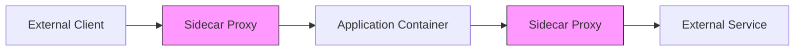

Alright! Let’s **deep dive into the Sidecar Proxy in Service Mesh** with the same structured approach, including charts, advanced configurations, and administrator-level insights.

---

# **Service Mesh Topic: Sidecar Proxy**

---

## **1. What is a Sidecar Proxy?**

- **Definition:**  
  A **sidecar proxy** is a lightweight process deployed alongside application containers in a pod to handle networking concerns like routing, security, and observability.  
  Examples: **Envoy**, **Linkerd Proxy**.

- **Purpose:**  
  - Offload networking logic from the application.
  - Enforce service mesh policies (e.g., retries, timeouts, mTLS).
  - Collect telemetry data for observability.

---

## **2. Key Features of Sidecar Proxy**

| **Feature**              | **Description**                                                                 |
|---------------------------|---------------------------------------------------------------------------------|
| **Traffic Management**    | Handles routing, retries, load balancing, failover, and protocol translation.   |
| **Security**              | Implements mutual TLS (mTLS), authentication, and authorization.               |
| **Observability**         | Collects metrics, logs, and distributed traces.                                |
| **Fault Injection**       | Simulates failures for testing resilience.                                     |
| **Protocol Support**      | Supports HTTP/1.1, HTTP/2, gRPC, WebSocket, TCP, and more.                     |

---

## **3. How Does the Sidecar Proxy Work?**

- **Deployment:**  
  The sidecar proxy is injected into each pod alongside the application container.

- **Traffic Flow:**  
  - Incoming traffic: External requests → Sidecar → Application.  
  - Outgoing traffic: Application → Sidecar → External service.

---

## **4. Advanced Sidecar Proxy Configurations**

### **A. Explicit Sidecar Configuration**

```yaml
apiVersion: networking.istio.io/v1beta1
kind: Sidecar
metadata:
  name: custom-sidecar
  namespace: default
spec:
  workloadSelector:
    labels:
      app: my-app
  ingress:
  - port:
      number: 8080
      protocol: HTTP
      name: http
    defaultEndpoint: 127.0.0.1:8080
  egress:
  - hosts:
    - "default/*"
    - "istio-system/*"
```
**Effect:**  
- Defines ingress and egress for pods labeled `app: my-app`.
- Allows communication with services in `default` and `istio-system` namespaces.

---

### **B. Restricting Outbound Traffic**

```yaml
apiVersion: networking.istio.io/v1beta1
kind: Sidecar
metadata:
  name: restricted-sidecar
  namespace: default
spec:
  outboundTrafficPolicy:
    mode: REGISTRY_ONLY
```
**Effect:**  
Only allows traffic to registered services; blocks all other outbound traffic.

---

### **C. Per-Workload Configuration**

```yaml
apiVersion: networking.istio.io/v1beta1
kind: Sidecar
metadata:
  name: workload-specific-sidecar
  namespace: default
spec:
  workloadSelector:
    labels:
      app: backend
  ingress:
  - port:
      number: 9090
      protocol: HTTP
      name: http
    defaultEndpoint: 127.0.0.1:9090
```
**Effect:**  
Applies sidecar settings only to pods labeled `app: backend`.

---

## **5. Visual: Sidecar Proxy Traffic Flow**



---

## **6. Observability: Monitoring Sidecar Proxy**

### **A. Metrics**
- **Key Metrics:**  
  - `istio_requests_total`: Total requests handled by the proxy.  
  - `istio_request_duration_seconds`: Latency of requests.  
  - `istio_tcp_connections_open`: Active TCP connections.

### **B. Tracing**
- Distributed traces show the journey of requests through sidecars.
- Tools: Jaeger, Zipkin.

### **C. Logs**
- Envoy logs provide detailed information about traffic handled by the sidecar.

---

## **7. Real-World Patterns and Scenarios**

### **A. Multi-Tenant Isolation**
- Use separate sidecar configurations for each tenant to isolate traffic.

### **B. Protocol Translation**
- Translate external REST calls to internal gRPC via the sidecar proxy.

### **C. Fault Injection for Resilience Testing**
```yaml
apiVersion: networking.istio.io/v1beta1
kind: VirtualService
metadata:
  name: fault-injection
spec:
  hosts:
  - "my-service"
  http:
  - route:
    - destination:
        host: my-service
      fault:
        delay:
          percentage: 50
          fixedDelay: 5s
        abort:
          percentage: 10
          httpStatus: 500
```
**Effect:**  
Simulates 50% delayed responses and 10% HTTP 500 errors for `my-service`.

---

## **8. Security Patterns**

### **A. Mutual TLS (mTLS) Between Sidecars**

```yaml
apiVersion: security.istio.io/v1beta1
kind: PeerAuthentication
metadata:
  name: mtls-peer-auth
  namespace: default
spec:
  mtls:
    mode: STRICT
```
**Effect:**  
Enforces mTLS for all traffic between sidecars in the `default` namespace.

---

### **B. Authorization Policies**

```yaml
apiVersion: security.istio.io/v1beta1
kind: AuthorizationPolicy
metadata:
  name: sidecar-auth-policy
  namespace: default
spec:
  selector:
    matchLabels:
      app: my-app
  rules:
  - from:
    - source:
        namespaces: ["trusted"]
    to:
    - operation:
        methods: ["GET", "POST"]
```
**Effect:**  
Allows only `GET` and `POST` requests from pods in the `trusted` namespace.

---

## **9. Troubleshooting Sidecar Proxy**

| Symptom                        | Possible Cause                     | How to Investigate                  |
|--------------------------------|------------------------------------|-------------------------------------|
| High latency                   | Misconfigured retries/timeouts     | Check VirtualService settings       |
| Connection errors              | mTLS issues                        | Verify PeerAuthentication policies  |
| Traffic bypassing sidecar      | Missing sidecar injection          | Check pod labels and Istio injection |
| Unexpected outbound traffic    | OutboundTrafficPolicy not applied  | Verify Sidecar configuration        |

---

## **10. Best Practices**

- **Restrict outbound traffic** with `REGISTRY_ONLY` mode.
- **Use workload-specific configurations** for sensitive services.
- **Enable mTLS by default** for secure communication.
- **Monitor sidecar performance** to detect bottlenecks.
- **Simulate faults** to test application resilience.
- **Document sidecar configurations** for audit and troubleshooting.

---

## **11. Quick Checklist**

- [ ] Are sidecars injected into all pods?
- [ ] Is mTLS enabled for secure communication?
- [ ] Are outbound traffic restrictions configured?
- [ ] Are sidecar metrics and logs monitored?
- [ ] Are fault injection policies tested in staging?

---

## **Summary Table: Sidecar Proxy**

| Feature                | Description                        | Example Config/Pattern              |
|------------------------|------------------------------------|-------------------------------------|
| Traffic Management     | Routing, retries, load balancing   | VirtualService + DestinationRule    |
| Security               | mTLS, authentication, authorization| PeerAuthentication + AuthPolicy     |
| Observability          | Metrics, logs, tracing             | Prometheus, Jaeger, Envoy logs      |
| Fault Injection        | Simulate delays and errors         | VirtualService fault settings       |
| Outbound Traffic Policy| Restrict external calls            | Sidecar with `REGISTRY_ONLY` mode   |

---

# **Would you like to:**
- Try a hands-on advanced scenario (e.g., fault injection, mTLS setup)?
- Take a quick quiz/checklist?
- Move to the next topic (e.g., traffic management, retries)?
- Or go even deeper into sidecar extensibility and custom filters?

**Let me know your choice!**
