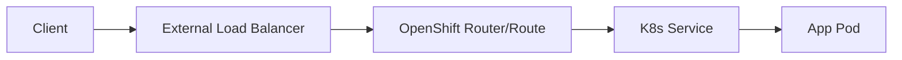
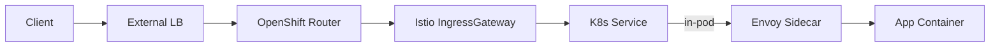
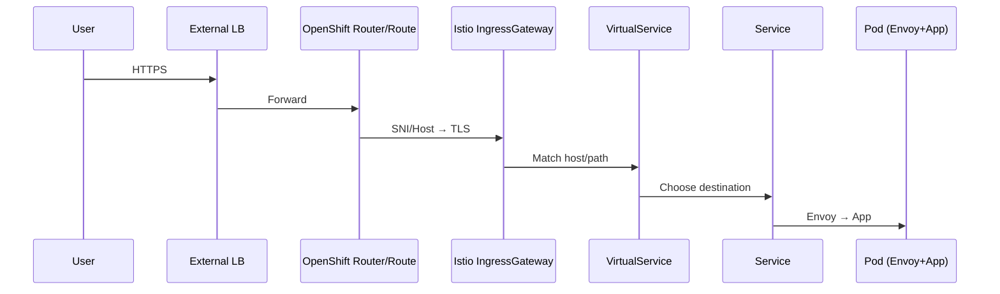

# Istio & Service Mesh in OpenShift — Theory‑First Mentor Path (No Code)

> **Headline:** Learn the core ideas step‑by‑step — no commands, no YAML — just crystal‑clear concepts and diagrams.

---

## How to use this guide

- Read **Module 1 → 8** in order (10–12 minutes each).
- Skim the **Cheat Sheet** and do the **Quick Quiz** at the end.
- When you’re comfortable, tell me "Ready for hands‑on" and I’ll unlock the lab version with commands.

---

## Module 1 — Microservices Networking 101 (OpenShift context)

**Goal:** Understand the baseline before a mesh.

- **Pods** run your app containers; **Services** (ClusterIP) give stable virtual IPs to reach pods.
- External users hit **DNS → External LB → OpenShift Router (HAProxy) → Route → Service → Pod**.
- **L4 vs L7:** L4 = TCP/UDP (connection), L7 = HTTP/HTTPS/gRPC (application semantics).
- **TLS:** encryption between client and the OpenShift Router/Route; inside cluster often plaintext unless you add it yourself.

### Diagram — Without Mesh

---

## Module 2 — What is a Service Mesh?

**Definition:** A **layer** that transparently manages service‑to‑service communication.

- **Data plane:** tiny network proxies (Envoy) run **next to each pod** (the *sidecar*).
- **Control plane:** a brain (Istiod) distributes config/policy to all sidecars.
- **Transparent:** your app code keeps using HTTP/DB clients — proxies handle the rest.

**Why teams add a mesh**

- **Security:** automatic **mTLS** between services with certificate rotation.
- **Reliability:** timeouts, retries, circuit‑breaking without code changes.
- **Traffic control:** canary, A/B, header/path routing.
- **Observability:** unified metrics, traces, access logs.

### Diagram — With Mesh

---

## Module 3 — Key Actors in OpenShift + Istio

- **Envoy (sidecar):** per‑pod proxy; intercepts inbound/outbound.
- **Istiod (control plane):** pushes config/policy, manages certificates/identity.
- **IngressGateway (Envoy at edge):** single door for traffic into the mesh.
- **EgressGateway (optional):** single door for traffic leaving the mesh.
- **Kiali:** UI for topology, metrics, and effective policies.
- **Jaeger:** distributed tracing (request path across services).
- **Prometheus/Grafana:** metrics store + dashboards.
- **Cert Manager (or OCP certs):** automates TLS certs for gateways/hosts.

---

## Module 4 — Core Concepts & Plain‑English Definitions

- **mTLS (mutual TLS):** both client and server prove identity + encrypt traffic.
- **SPIFFE identity:** each workload gets a unique ID based on its **service account**; used in mTLS.
- **Zero Trust (deny‑by‑default):** no service can talk to another unless policy allows it.
- **AuthorizationPolicy:** "**Who** is allowed to call **which** workload (and where)."
- **PeerAuthentication:** turn mTLS on/off and set mode (STRICT/PERMISSIVE) per ns/workload.
- **Sidecar (CRD):** defines what destinations a workload’s proxy may talk to (egress scope).
- **ServiceEntry:** register **external** services (DBs/APIs) so the mesh recognizes and permits them.
- **Gateway:** binds ports/hosts/certs at the edge (ingress to the mesh).
- **VirtualService:** L7 rules: host/path/header matching, rewrites, traffic split.
- **DestinationRule:** connection policy + subsets (v1/v2) for canary/blue‑green.

---

## Module 5 — Traffic Flows (Mental Models)

### 5.1 Ingress (user → your service)

### 5.2 East‑West (service ↔ service)

- Caller pod → its **sidecar** → **mTLS** → callee sidecar → callee app.
- **Policy checks** happen before the request reaches the callee app.

### 5.3 Egress (your service → external API)

- By default, proxies only talk to **known** (registered) destinations.
- If no **ServiceEntry**, traffic is sent to a **black‑hole** (blocked) cluster.

---

## Module 6 — Security Posture You Get by Default

- **Workload identity** comes from Kubernetes service accounts.
- **mTLS everywhere** (when STRICT): encrypt + authenticate pods.
- **Deny‑all** until explicit **AuthorizationPolicy** allows specific callers.
- **Egress control:** only destinations in the registry/ServiceEntry are reachable.
- **Edge hardening:** gateways can add/remove headers, CSP, XSS, caching controls.

---

## Module 7 — Observability & Day‑2 Operations

- **Kiali graph:** live map of services, success/error rates, mTLS locks.
- **Traces (Jaeger):** follow a request across multiple services.
- **Golden signals:** latency, traffic, errors, saturation at the mesh level.
- **Common failure patterns:**
  - Sidecar missing → traffic bypasses mesh/policy.
  - mTLS mode mismatch → handshakes fail.
  - No AuthorizationPolicy → denied by default.
  - No ServiceEntry → egress blocked (black‑hole cluster).
  - VirtualService host/path mismatch → 404 or route miss.

---

## Module 8 — When (and When Not) to Use a Mesh

**Great fit:** many services, zero‑trust needs, canary/traffic shaping, uniform telemetry, regulated environments.

**Maybe skip:** few services, very latency‑sensitive paths, ultra‑simple apps, or where a single API gateway + library retries suffice.

**Overheads to plan for:** extra pods per workload, some CPU/memory, small latency hop via proxies, added operational complexity.

---

## One‑Page Cheat Sheet (keep handy)

- **Data plane:** Envoy sidecars in every pod.
- **Control plane:** Istiod distributing config and certs.
- **Ingress:** Gateway + VirtualService route inbound.
- **Security:** PeerAuthentication (mTLS), AuthorizationPolicy (who can call whom).
- **Egress:** Sidecar (scope) + ServiceEntry (allow specific external hosts).
- **Traffic mgmt:** VirtualService (match/split), DestinationRule (LB/subsets).
- **Observability:** Kiali (topology), Jaeger (traces), Prometheus/Grafana (metrics).

---

## Quick Quiz (self‑check)

1. What problem does mTLS solve inside the cluster that normal TLS at the router does not?
2. Why is “deny‑by‑default” safer for microservices?
3. Which two resources work together to expose your app publicly via the mesh?
4. If a pod cannot call an external API, what mesh object might be missing?
5. Where do you inspect a live topology and see error rates/locks?

---

## Next Step

When you’re comfortable with the concepts, say: **“ready for hands‑on”**. I’ll give you a guided, copy‑paste lab in small chunks. No big dumps, and we’ll verify each step as we go.

