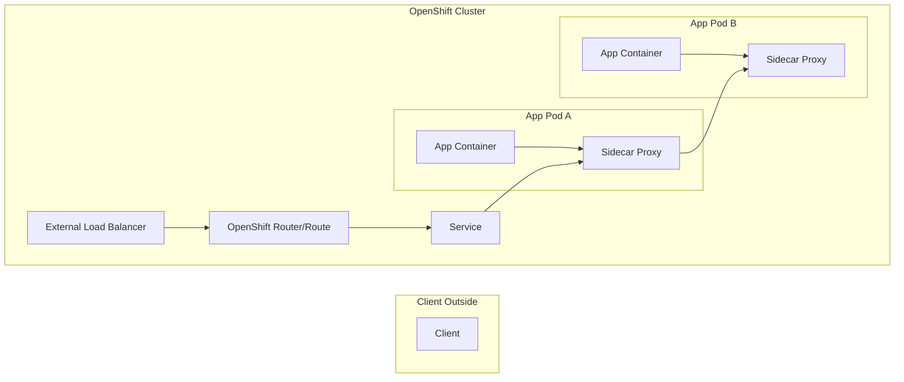

Here’s **Module 2** continuing our structured mentor-style journey.

---

# Module 2 — Why Service Mesh? (The Gaps in Plain OpenShift Networking)

**Goal:** Understand the problems that *basic Kubernetes/OpenShift networking* cannot solve easily, and why service mesh (Istio) is needed.

---

### 1. **What You Already Have (from Module 1)**

* Stable service discovery (`Service → Pod`)
* Load balancing across pods
* External traffic routing via Router/Route

✅ Works fine for simple apps.

---

### 2. **The Gaps (Real-World Needs in Microservices)**

1. **Service-to-Service Security**

   * Out of the box → pod-to-pod traffic is usually **plaintext**.
   * Enterprises want **mTLS (mutual TLS)** between services inside the cluster.

2. **Observability**

   * Kubernetes doesn’t show *which pod called which service, how long it took, errors, retries*.
   * Need detailed telemetry: traces, metrics, logs.

3. **Traffic Control**

   * Hard to do *fine-grained routing* (e.g., send 10% traffic to v2, 90% to v1 for canary).
   * No out-of-box retries, timeouts, circuit breaking.

4. **Policy & Governance**

   * “Service A should not talk to Service B” (zero-trust) → hard to enforce.
   * No built-in *service-level access control*.

---

### 3. **Service Mesh = Layer on Top of K8s Networking**

* **Data Plane (Sidecar Proxy)**: Runs alongside each pod (usually Envoy). Handles *traffic, security, telemetry*.
* **Control Plane**: Central brain (Istio Pilot, Citadel, Mixer etc.) → manages sidecars with config.

---

### 4. **How It Changes Networking**

Without Mesh → Pod talks directly to Pod via Service.
With Mesh → Pod traffic goes through Sidecar (proxy), then across to destination pod’s sidecar, then to the pod.

---

### Diagram — With Mesh in Place

---

### 5. **Key Idea to Take Forward**

* Service mesh ≠ replacing Kubernetes networking → it *augments* it.
* Think: **K8s gives you connectivity; Service Mesh adds intelligence, security, and control on top.**

---

👉 Next (Module 3), we’ll break down **Istio architecture** (data plane, control plane, sidecars, gateways).

Would you like me to also include **a simple real-world analogy** (like how post offices + couriers work) to make the mesh concept more intuitive before we dive into Istio internals?
