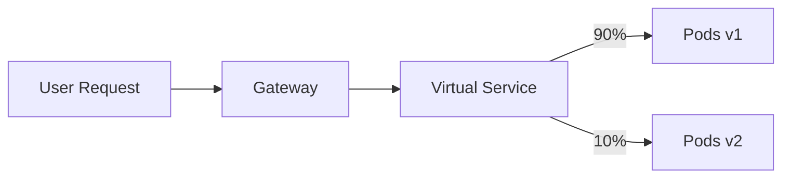

Great 👍 now we’re stepping into the heart of Istio’s power: **Traffic Management**.
This is where Istio goes beyond “just networking” and enables **smart routing, load balancing, and resilience**.

---

# 📘 Module 4 — Traffic Management in Istio

## 1. Why Traffic Management Matters

In microservices, you often need to:

* Release a new version without downtime (canary, blue/green).
* Split traffic between versions (A/B testing).
* Apply **timeouts, retries, circuit breaking** to protect your system.
* Route based on **headers, paths, or users** (fine-grained control).

Plain Kubernetes `Service` only does **round-robin load balancing**. That’s it.
Istio adds **intelligence at Layer 7 (application layer)**.

---

## 2. The Key Istio Objects for Traffic

* **Gateway** → entry point to the mesh (handles external traffic).
* **VirtualService** → rules for how to route traffic (paths, headers, percentages).
* **DestinationRule** → policies for connections (load balancing, subsets = versions).

Together they define:
👉 *Where traffic comes in, how it gets routed, and how it’s balanced across versions.*

---

## 3. Examples of Traffic Control Scenarios

### a) **Basic Routing**

* Match by **host name** and send to a Kubernetes service.
* Example: `api.example.com → my-service`.

### b) **Path / Header Routing**

* `/v1/*` goes to version 1 of service.
* `/v2/*` goes to version 2.
* Or, requests with header `user: beta` go to v2.

### c) **Canary / Traffic Splitting**

* 90% of traffic → v1 pods.
* 10% of traffic → v2 pods.
* Gradually increase v2 as confidence grows.

### d) **Blue-Green Deployments**

* Two full environments (blue & green).
* Switch 100% of traffic from one to the other instantly.

### e) **Resilience Patterns**

* **Retries:** If one pod fails, sidecar retries request.
* **Timeouts:** Prevents client from waiting too long.
* **Circuit Breaking:** Stops flooding a failing service with more requests.

---

## 4. Diagram — Traffic Splitting



---

## 5. Key Takeaways

* **VirtualService** = *how* requests are routed.
* **DestinationRule** = *policies* for subsets/versions.
* **Gateway** = edge entry for external traffic.
* Istio allows you to control **traffic flow like a network engineer, without changing app code**.

---

✅ Up to here, you understand how Istio **manages traffic smarter than Kubernetes services**.

👉 Next (Module 5), we’ll look at **real traffic flows in action** (Ingress, East-West, and Egress), and tie traffic rules + security policies together.

Perfect 👍 — let’s visualize **how VirtualService and DestinationRule work together**, because this pairing is the heart of Istio traffic management.

---

# 🎯 VirtualService + DestinationRule — Working Together

### 1. VirtualService (Traffic Routing Rules)

* Defines **where traffic should go** (logic at L7).
* Examples:

  * `/login → Service A`
  * `/checkout → Service B`
  * `90% → v1, 10% → v2`
  * Mirror all requests to `v3`

👉 Think of it as a **GPS map**: “if user is going here, take this road.”

---

### 2. DestinationRule (Policies & Subsets)

* Defines **how to connect** to the chosen destination.
* Examples:

  * Subsets based on labels (`version: v1`, `version: v2`).
  * Connection policies (mTLS, LB type: round-robin, least-request).
* Without subsets, VirtualService can’t do traffic splits.

👉 Think of it as the **road conditions**: speed limit, lanes, toll rules.

---

### 3. How They Work Together

```mermaid
flowchart LR
  C[Client Request] --> VS[VirtualService]
  VS -->|match /checkout| DR[DestinationRule]
  DR -->|subset v1 (90%)| P1[Pod v1]
  DR -->|subset v2 (10%)| P2[Pod v2]
```

* **VirtualService**: decides request goes to `/checkout`.
* **DestinationRule**: says “checkout has v1 (90%) and v2 (10%).”
* Sidecars enforce these rules automatically.

---

### 🔑 Memory Hook

* **VirtualService = “Where to go.”**
* **DestinationRule = “How to go (and which version).”**
* They always **work in pairs** for canary, blue-green, retries, and mirroring.


