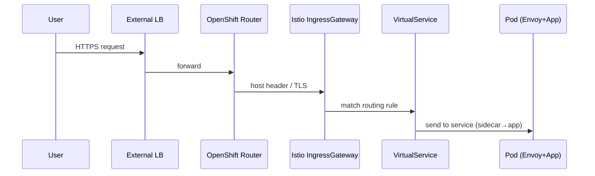
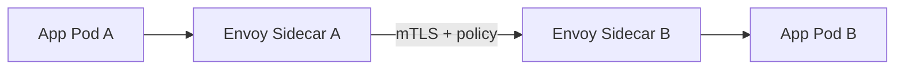
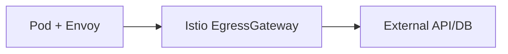

Excellent 🔥 we’re now at the **traffic flow layer**, which ties together what we’ve learned so far (networking baseline + Istio architecture + traffic management).

---

# 📘 Module 5 — Real Traffic Flows in Istio

---

## 1. Three Types of Traffic

When we talk about Istio in OpenShift, there are **three main directions traffic flows**:

1. **Ingress (North-South)** → *outside world → cluster*
2. **East-West (Service-to-Service inside cluster)**
3. **Egress (Cluster → external APIs/DBs)**

Each flow is affected by Istio’s **traffic rules** (VirtualService, DestinationRule) and **security rules** (mTLS, AuthorizationPolicy, ServiceEntry).

---

## 2. Ingress Traffic (North-South)

* **Path:** Client → External LB → OpenShift Router → Istio Ingress Gateway → VirtualService → Service → Pod (via sidecar).
* **Why important:** This is the *main door* into your apps.
* **Controls you get:**

  * Hostname- or path-based routing.
  * TLS termination + mTLS to backend pods.
  * Header rewrites, rate limits, security filters.

### Diagram — Ingress

---

## 3. East-West Traffic (Service ↔ Service inside the cluster)

* **Path:** Pod A → Envoy A → (mTLS, policy checks) → Envoy B → Pod B.
* **Why important:** This is the majority of microservices chatter.
* **Controls you get:**

  * **mTLS everywhere** → encryption + identity.
  * **AuthorizationPolicy** → “who can call whom.”
  * **Retries/timeouts** → stability under failure.
  * **Telemetry** → traces of service-to-service calls.

### Diagram — East-West

---

## 4. Egress Traffic (Cluster → External World)

* **Path:** Pod → Sidecar → (optional Egress Gateway) → External Service (e.g., GitHub API, external DB).
* **Why important:** Without control, workloads could leak data to the internet.
* **Controls you get:**

  * **ServiceEntry** → explicitly register external hosts (e.g., `api.github.com`).
  * **Sidecar egress rules** → restrict pods to certain destinations.
  * **Egress Gateway** → single controlled exit door, for auditing & firewalling.
  * By default, **unknown hosts = blocked** (black-hole cluster).

### Diagram — Egress

---

## 5. Tying It All Together

* **Ingress (north-south):** Gateways + VirtualService secure entry.
* **East-West (east-west):** mTLS, AuthorizationPolicy, retries/timeouts.
* **Egress (south-north):** ServiceEntry + Sidecar/EgressGateway control outbound.

---

## 6. Key Takeaways

* Istio doesn’t replace Kubernetes Services → it **enhances traffic flows** with *policies + intelligence*.
* **Every request** (north-south, east-west, egress) passes through **Envoy sidecars or gateways**.
* **Security + routing rules** are consistently applied everywhere.
* You get **observability for free** (every request is traced and measured).

---

✅ With this, you now know **how requests move through the mesh** and how Istio enforces rules at each stage.

👉 Next (Module 6), we’ll dive into the **Security Posture**: how Istio enforces **Zero Trust by default**, why mTLS is automatic, and how AuthorizationPolicies give fine-grained access.

Do you want me to also create a **“one request lifecycle” story** (step-by-step: what happens when a user request comes from the internet to your app pod) to make Module 5 even more concrete?
