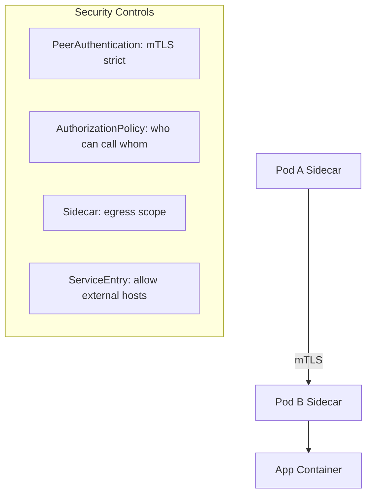

Perfect, let’s go deep into **Istio’s Security Posture** — this is one of the main reasons enterprises adopt a service mesh.

---

# 📘 Module 6 — Security Posture in Istio

---

## 1. The Default Security Model: **Zero Trust**

* In plain Kubernetes, once pods can reach each other on the network, **all communication is open** unless you add **NetworkPolicies**.
* In Istio, the **default stance is deny**:

  * Services **cannot talk to each other** unless explicitly allowed.
  * This is the principle of **Zero Trust**: *“Never trust, always verify.”*

✅ This ensures you don’t have accidental lateral movement or data leaks inside the cluster.

---

## 2. Automatic **mTLS** (Mutual TLS)

* Normally, TLS = client verifies server’s certificate.
* **mTLS** = both sides (client & server) verify each other.
* Istio **sidecars (Envoy)** handle:

  * **Issuing certificates** per workload (via Istiod).
  * **Rotating certificates** automatically before expiry.
  * **Encrypting all pod-to-pod traffic**.

🔒 **Result:** Every request between pods is authenticated + encrypted, without changing app code.

---

## 3. Workload Identity

* In Istio, each pod is tied to a **Kubernetes ServiceAccount**.
* This identity is embedded in the pod’s certificate (SPIFFE standard).
* Example:

  * `spiffe://cluster.local/ns/payments/sa/backend`
  * This means: *namespace = payments, service account = backend*.
* Policies can now say: *“Only pods with this service account can talk to X.”*

---

## 4. Security Policies You Can Apply

1. **PeerAuthentication**

   * Controls if mTLS is required (STRICT, PERMISSIVE, or DISABLE).
   * Example: “All pods in namespace must use mTLS.”

2. **AuthorizationPolicy**

   * Controls **who can talk to whom**.
   * Rules can match by service account, namespace, IP, request headers, paths, or ports.
   * Example: “Only frontend service can call payments backend on port 8080.”

3. **Sidecar (egress control)**

   * Defines which destinations a pod is allowed to talk to.
   * By default, external traffic is blocked unless explicitly opened.

4. **ServiceEntry (external access)**

   * Registers external services (APIs, databases) so the mesh knows they are valid destinations.
   * Example: “Allow calls to api.github.com on port 443.”

---

## 5. Egress & Data Protection

* Without Istio: Any pod could curl `http://malicious-site.com`.
* With Istio:

  * **Unknown hosts → black-hole cluster (blocked).**
  * You must create a **ServiceEntry** for allowed external traffic.
* Optional: Use an **Egress Gateway** as a single exit door → enables logging, inspection, firewalling.

---

## 6. Diagram — Security Enforcement

---

## 7. Key Takeaways

* Istio’s **Zero Trust posture** means: everything is denied until policies allow.
* **mTLS is automatic**, so encryption + workload identity are enforced by proxies.
* **AuthorizationPolicies** give you fine-grained control (per service account, port, path).
* **Sidecar + ServiceEntry** block data exfiltration to the internet.
* Together, these controls **protect your apps without modifying code**.

---

✅ You now understand how Istio **hardens security inside the cluster**.

👉 Next (Module 7), we’ll explore **Observability & Day-2 Operations** — how Istio gives you metrics, traces, and live service graphs via Kiali, Jaeger, and Prometheus.

Would you like me to also create a **“story of a blocked request”** (step-by-step of what happens when Pod A tries to call Pod B without a policy) to really bring Module 6 to life?
