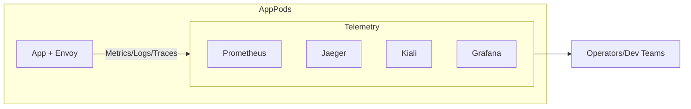

Great — now we’ll cover **how Istio helps you *see* what’s happening inside your mesh**.
This is Module 7, focusing on **Observability & Day-2 Operations**.

---

# 📘 Module 7 — Observability & Day-2 Operations in Istio

---

## 1. Why Observability Matters

* In microservices, a single user request may touch **5, 10, 20+ services**.
* Without visibility, it’s nearly impossible to debug **latency, errors, or bottlenecks**.
* Istio gives observability **for free** via its sidecars:

  * Every request is logged, traced, and measured.
  * You don’t need to change application code.

---

## 2. The Observability Trio

Istio integrates with three major tools (often pre-packaged in OpenShift Service Mesh):

* **Kiali (Topology & Live Graphs)**

  * UI for visualizing traffic flow across the mesh.
  * Shows:

    * Service graph with success/error rates.
    * Which services are calling which.
    * Locks on connections = mTLS enabled.
    * Applied policies (Authorization, PeerAuth, etc.).

* **Jaeger (Tracing)**

  * Shows the *path of a single request* across services.
  * Lets you see where time is spent (latency breakdown).
  * Useful for debugging performance issues.

* **Prometheus & Grafana (Metrics)**

  * **Prometheus**: stores metrics scraped from Envoy proxies.
  * **Grafana**: dashboards for latency, traffic volume, error rate (“golden signals”).

---

## 3. How It Works (under the hood)

* **Envoy sidecars** generate telemetry for every request.
* Metrics → Prometheus, Logs → standard logging, Traces → Jaeger.
* Kiali pulls from Prometheus + Istio config to show live service maps.

---

## 4. Typical Day-2 Operations with Istio

* **Check traffic flows** in Kiali when onboarding a new service.
* **Debug errors**: See which service is failing or denying requests.
* **Latency analysis**: Use Jaeger to see which hop in a chain is slow.
* **Policy validation**: Confirm mTLS is on, AuthorizationPolicies are active.
* **Capacity planning**: Use Prometheus metrics for traffic & saturation trends.

---

## 5. Diagram — Observability Data Flow

---

## 6. Key Takeaways

* Observability is **built-in** with Istio sidecars — no extra coding needed.
* **Kiali = topology map**, **Jaeger = request traces**, **Prometheus/Grafana = metrics & dashboards**.
* Together, they give you the **golden signals**:

  * Latency
  * Traffic
  * Errors
  * Saturation
* This is the foundation for **monitoring, troubleshooting, and capacity planning** in Day-2 operations.

---

✅ With Module 7, you can now *see how Istio makes microservices transparent*.

👉 Next (Module 8), we’ll discuss **when and when not to use a mesh** — because while Istio is powerful, it’s not always the right tool for every system.

Would you like me to add a **real-world debugging story** (e.g., “User request failing → how Kiali + Jaeger reveal the culprit”) to make Module 7 more practical?
