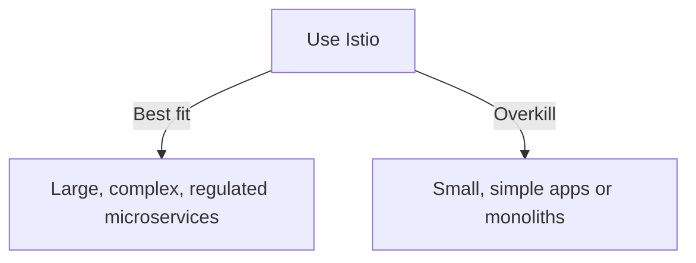

Alright 🚀 we’ve reached the last piece of your theory-first journey. This module helps you decide *when Istio is the right tool — and when it might be overkill*.

---

# 📘 Module 8 — When (and When Not) to Use a Mesh

---

## 1. When a Service Mesh *Shines* 🌟

You’ll benefit from Istio if your system has:

* **Many microservices** (dozens → hundreds).
* **Zero Trust requirements** (e.g., banking, healthcare, regulated industries).
* **Complex release strategies** like canary, blue-green, A/B tests.
* **Strict compliance** → need encrypted pod-to-pod communication and auditable flows.
* **SRE/DevOps priorities** → want unified telemetry (metrics, logs, traces) without touching app code.

👉 In these environments, the **cost of managing microservices manually is greater** than Istio’s complexity.

---

## 2. When a Service Mesh *Might Be Overkill* ⚖️

Istio introduces sidecars, gateways, and a control plane → that means **extra CPU, memory, and operational complexity**. It may not be worth it if:

* **Few services** (3–5 simple apps).
* **Latency-sensitive apps** (extra hop through proxies might matter).
* **Team has no ops bandwidth** to maintain Istio upgrades & configs.
* **Simple needs** → a reverse proxy (NGINX/HAProxy) or API gateway alone is enough.
* **Monolith or small-scale deployments** → no real gain from per-service traffic control.

---

## 3. Overheads & Trade-offs

* **Resource cost:** every pod runs a sidecar → more CPU/memory usage.
* **Operational cost:** need to manage Istio upgrades, configs, and debugging.
* **Learning curve:** engineers must learn new CRDs (VirtualService, DestinationRule, PeerAuth, etc.).

But…
✅ For complex, regulated, high-scale systems → these costs are **less than the risk** of insecure or blind networking.

---

## 4. Decision Cheat Sheet

Ask yourself:

* **Do I need zero-trust between pods?** → If *yes*, mesh is a strong fit.
* **Do I deploy features with canary/blue-green?** → Mesh makes it painless.
* **Do I have many services and can’t trace requests easily?** → Mesh gives observability out of the box.
* **Is my app simple, low-scale, or latency-critical?** → Mesh might be overkill.

---

## 5. Diagram — Trade-off Summary

---

## ✅ Key Takeaway

* **Istio is not “always use.”** It’s a **tool for scale, complexity, and security**.
* Use it when the benefits (security, observability, control) outweigh the added cost.

---

🎉 Congrats — you’ve now completed the **8-module theory-first mentor path**.
You understand: baseline networking → service mesh basics → Istio architecture → traffic control → security → observability → trade-offs.

👉 Next step: If you’re ready, I can shift into **hands-on mode** and guide you through a **mini lab** on OpenShift (deploy sample apps, apply policies, see Kiali).

Do you want me to start preparing the **hands-on Module 1 lab (no big dumps, just small guided steps)** now?
