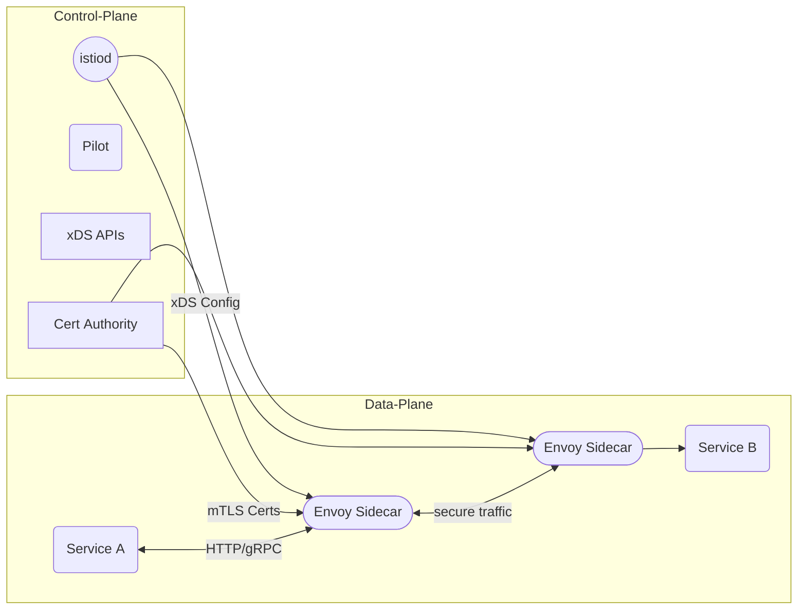
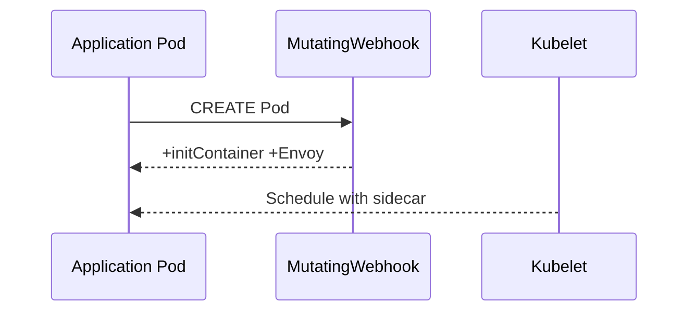
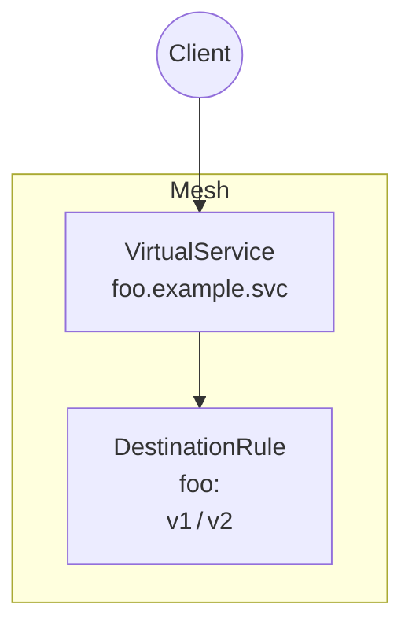
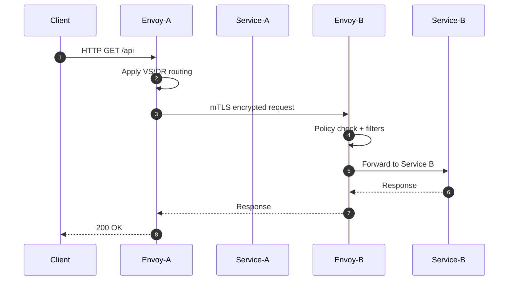
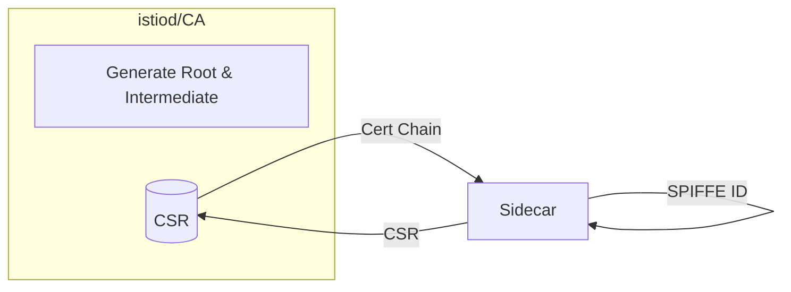
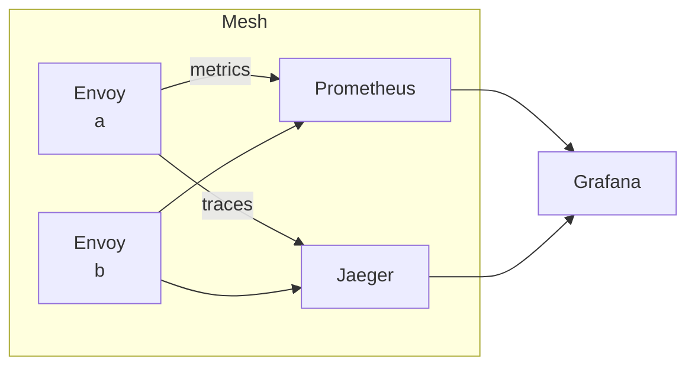

# Istio Service-Mesh – Complete Theoretical Guide  
_theory.md_

---

## 1. Introduction

### 1.1  From Monoliths ➡ Micro-Services  
The shift to micro-services increases:
* Service-to-service traffic
* Polyglot stacks
* Operational complexity (timeouts, retries, security, observability)

### 1.2  What Is a **Service-Mesh**?  
A dedicated infrastructure layer that handles **L4/L7** concerns _outside_ of application code, providing:
1. **Traffic management** (routing, resiliency)
2. **Security** (mTLS, authZ/authN)
3. **Observability** (metrics, logs, traces)

### 1.3  Why Istio?  
* Kubernetes-native, but platform-agnostic  
* Battle-tested control plane + Envoy data plane  
* Rich CRD surface → declarative operations  
* Extensible (Wasm, EnvoyFilters)

---

## 2. High-Level Architecture



### 2.1  Control Plane (istiod ≥ 1.6)
* **xDS server (Pilot)** – generates Envoy config  
* **CA** – issues SPIFFE/SVID certificates  
* **Validation Webhook** – schema enforcement

### 2.2  Data Plane
* **Envoy sidecars** – transparent L4/L7 proxies
* **Gateways** – edge Envoys for ingress/egress

---

## 3. Installation & Deployment Models

| Model | How It Works | Pros | Cons |
|-------|--------------|------|------|
| **Sidecar-Injection** | Envoy injected per-Pod (manual or auto) | Mature, feature-complete | Extra hop & resources |
| **Ambient Mesh** | z-Tunnel (L4) + Waypoint (optional L7) | Lighter, incremental adoption | Still evolving |



---

## 4. Core CRDs & Concepts

### 4.1  Traffic Management
* **VirtualService** – _“where to send”_ + rich routing rules  
* **DestinationRule** – _“how to talk”_ (TLS mode, subsets)  
* **Gateway** – L7 proxy config for edge routes  
* **ServiceEntry** – register external services



### 4.2  Resilience Features
* Retries with jitter  
* Timeouts & circuit breakers  
* Outlier detection

### 4.3  Security
| Feature | Resource | Purpose |
|---------|----------|---------|
| **mTLS** | `PeerAuthentication` | Encrypt + authenticate traffic |
| **JWT validation** | `RequestAuthentication` | Verify tokens at edge or mesh-wide |
| **RBAC** | `AuthorizationPolicy` | Fine-grained allow/deny |

### 4.4  Observability
* Metrics: Prometheus, Grafana dashboards  
* Traces: Jaeger/Tempo/Zipkin  
* Logs: Envoy & application logs

---

## 5. Traffic-Flow Walk-Through



---

## 6. Security Deep-Dive

### 6.1  Mutual TLS Lifecycle



1. Envoy sidecar starts with Envoy SDS socket  
2. Requests a TLS cert (CSR) from istiod  
3. istiod signs & returns cert+key  
4. Sidecars establish mTLS using SPIFFE identity

### 6.2  Authorization Policy Example  
```
apiVersion: security.istio.io/v1beta1
kind: AuthorizationPolicy
metadata:
  name: payments-viewer
spec:
  selector:
    matchLabels:
      app: payments
  rules:
  - from:
    - source:
        principals: ["cluster.local/ns/frontend/sa/frontend-sa"]
    to:
    - operation:
        methods: ["GET"]
```

---

## 7. Extensibility

* **Wasm Filters** – custom L7 logic (rate-limit, A/B testing)  
* **EnvoyFilter CRD** – raw patching of Envoy config  
* **Telemetry APIs** – send mesh metrics to external back-ends

---

## 8. Observability Stack



* **Metrics** – Envoy → Prometheus → Grafana  
* **Tracing** – Envoy → Jaeger UI  
* **Logging** – Envoy access logs, k8s events

---

## 9. Best Practices & Pitfalls

1. **Incremental rollout** – start with ingress-only, then mTLS-per-namespace  
2. **Strict mTLS** – avoid permissive once stable  
3. **Resource tuning** – sidecar `requests/limits` critical for high-QPS apps  
4. **Version skew** – keep `< N−1` gap between control & data plane  
5. **Config hygiene** – prune stale `VirtualService` / `DestinationRule`

---

## 10. Comparative Landscape

| Feature           | Istio | Linkerd | Consul |
|-------------------|-------|---------|--------|
| L7 Routing        | ✅    | ➖      | ✅ |
| Pluggable Envoy   | ✅    | ❌ (Rust-proxy) | ✅ |
| mTLS by default   | ✅    | ✅      | ✅ |
| Extensibility     | Wasm  | Limited | Lua/Filters |
| Multi-Cluster     | ✅    | ✅(link) | ✅ |

---

## 11. Conclusion

Istio delivers a powerful, vendor-neutral service-mesh with first-class Kubernetes integration, rich security, and deep observability. While operationally heavier than lighter meshes, its feature breadth, community, and extensibility make it a solid choice for production micro-service environments.

_For hands-on labs & reference docs, see:_  
* https://istio.io  
* Istio Upgrade Guide  
* Envoy Proxy docs

---
````
